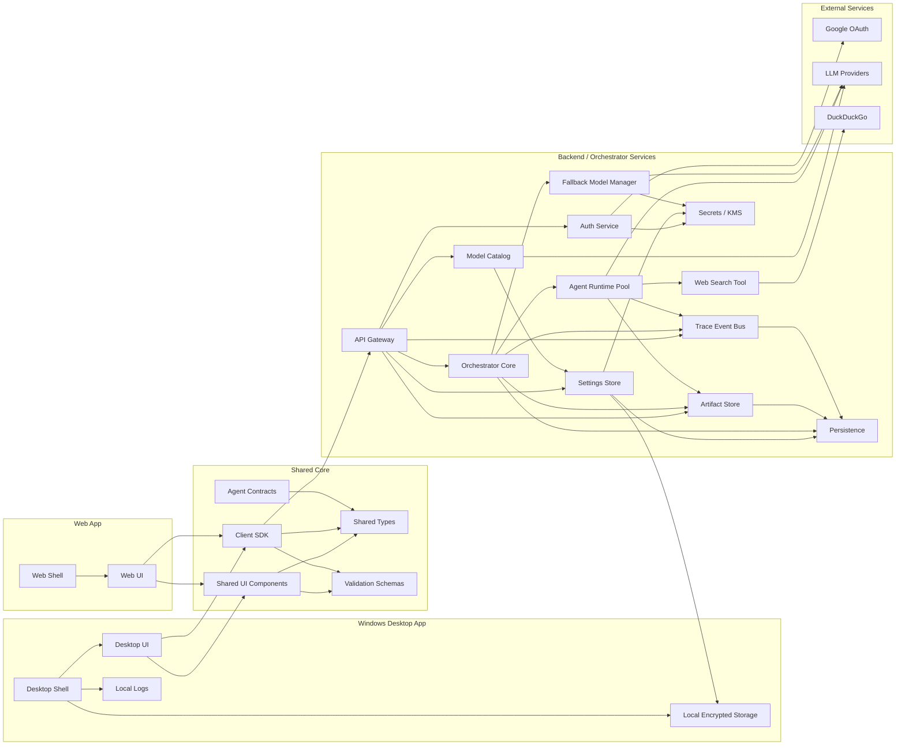
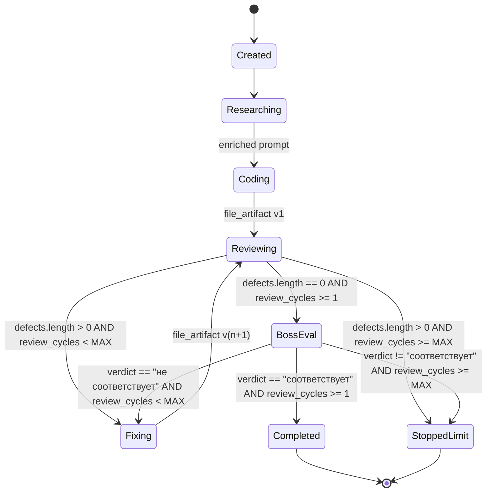
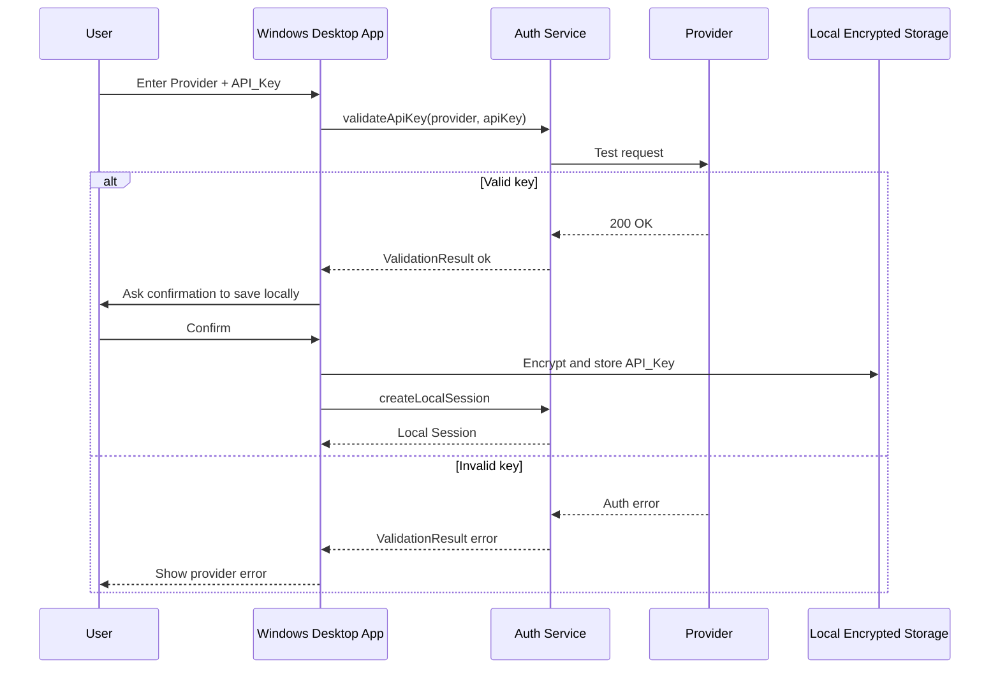
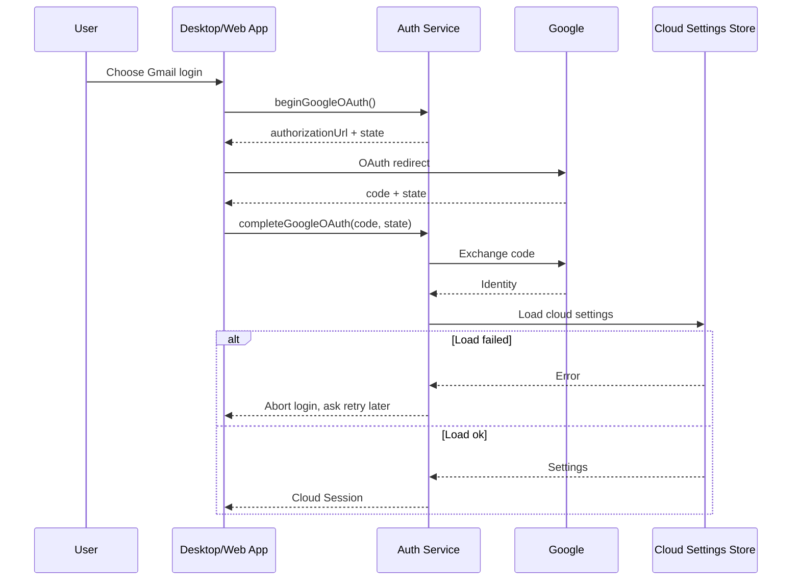
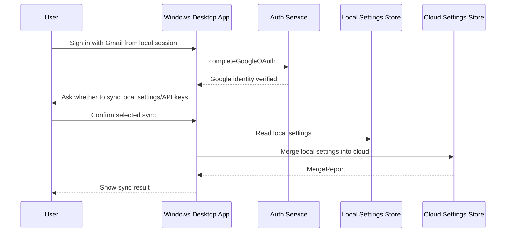
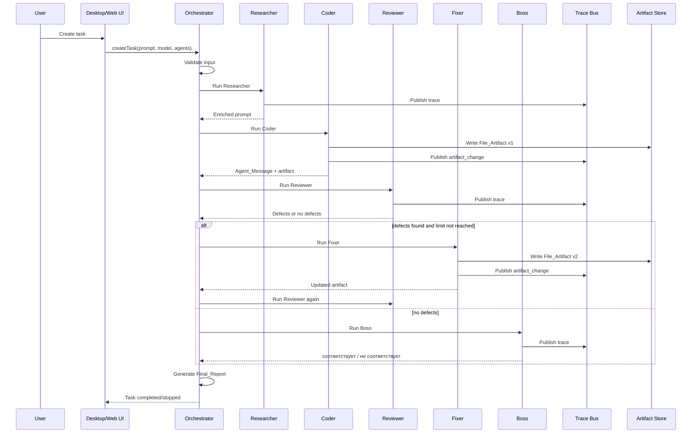

# Design Document

## Overview

AI Agent Orchestrator — это desktop-first приложение для Windows с дополнительной web-версией. Главная версия продукта — полноценное Windows PC приложение, которое позволяет пользователю запускать совместную работу нескольких ИИ-агентов над одной задачей, используя собственный API-ключ выбранного LLM-провайдера.

Web-версия является дополнительным интерфейсом, а не основным продуктом. Она должна использовать общие backend-сервисы, shared core, shared UI-компоненты и shared validation logic, но не должна диктовать архитектуру всего приложения как web-first.

Windows Desktop App не должен быть просто optional wrapper вокруг web-приложения. Он должен быть самостоятельной основной версией продукта с полноценным пользовательским сценарием:

- вход через API-ключ;
- вход через Gmail OAuth;
- локальное зашифрованное хранение API-ключей;
- выбор моделей;
- создание задач;
- выбор агентов;
- режим Auto;
- просмотр Agent_Trace;
- просмотр File_Artifact;
- просмотр diff между версиями файлов;
- просмотр Final_Report;
- история задач.

Платформа должна оставаться бесплатной для пользователя. Основной принцип: пользователь платит за токены через собственный API_Key выбранного Provider. Дополнительно может существовать fallback-режим на дешёвые или бесплатные platform backup models, но только при явном уведомлении пользователя и с ограничениями.

Главные архитектурные цели:

1. Сделать Windows Desktop App основным продуктом.
2. Сделать Web App дополнительной версией, которая переиспользует общую логику.
3. Разделить Desktop Shell, Web Shell, Shared Core, Backend/Orchestrator services, Local Storage и Cloud Storage.
4. Поддержать API-key-only локальную сессию без аккаунта.
5. Поддержать Gmail OAuth для cloud sync между Windows App и Web App.
6. Хранить API_Key безопасно: encrypted at-rest, decrypted only on explicit server-side request.
7. Реализовать deterministic agent pipeline: Researcher → Coder → Reviewer → (Fixer → Reviewer)* → Boss.
8. Обеспечить live visibility работы агентов через Agent_Trace.
9. Поддержать File_Artifact versioning и diff viewer.
10. Реализовать бесплатный Web_Search_Tool на DuckDuckGo.
11. Поддержать Custom_Agent.
12. Сформировать Final_Report после завершения Task.

---

## Product Direction

### Desktop-first principle

Система проектируется с приоритетом Windows Desktop App.

Это значит:

- Windows Desktop App — главный target.
- Web App — дополнительный target.
- Desktop App не должен зависеть от hosted Web App.
- Desktop App должен иметь полноценный UX и локальные возможности.
- Desktop App должен иметь локальное encrypted storage для API-key-only режима.
- Shared Core должен позволять переиспользовать бизнес-логику между desktop и web.
- Backend/Orchestrator services должны быть доступны обоим интерфейсам.

### Why desktop-first

Desktop-first выбран потому что основной пользовательский сценарий похож на developer tool:

- пользователь работает за Windows PC;
- пользователь запускает долгие agent tasks;
- пользователь смотрит файлы, diff, trace и report;
- пользователь может работать с локальными настройками;
- пользователь может не хотеть создавать аккаунт;
- пользователь хочет ощущение полноценной программы, а не только сайта.

---

## Goals

### Functional goals

- Provide a complete Windows Desktop App experience.
- Provide a secondary Web App interface.
- Support local API-key-only login.
- Support Gmail OAuth login.
- Support upgrade from local API-key-only session to Gmail cloud-sync session.
- Support encrypted local storage for Windows.
- Support encrypted cloud storage for Gmail accounts.
- Support multiple providers and multiple API keys.
- Support model catalog based on user's API keys.
- Support optional fallback models with platform backup keys.
- Support Task creation with prompt, model and agent selection.
- Support Auto_Mode and Manual_Mode.
- Support five Builtin_Agent roles:
  - Researcher
  - Coder
  - Reviewer
  - Fixer
  - Boss
- Support Custom_Agent creation and sync.
- Support deterministic pipeline execution.
- Support Agent_Message persistence and normalization.
- Support Agent_Trace streaming.
- Support File_Artifact versioning and diff viewing.
- Support Final_Report generation.

### Non-functional goals

- Secure secret storage.
- Predictable pipeline behavior.
- Clear error handling.
- UI responsiveness.
- Testability.
- Shared code between desktop and web.
- Avoid unnecessary paid services.
- Make fallback usage explicit and rate-limited.
- Make sync behavior safe and transparent.

---

## Non-goals

The first version does not need to provide:

- Mobile app.
- Public marketplace of agents.
- Paid subscriptions.
- Enterprise team management.
- Browser extension.
- Real-time multiplayer collaboration.
- Full local LLM runtime.
- Full IDE replacement.
- Automatic execution of arbitrary local system commands without sandboxing.
- Unrestricted file system access from agents.

---

## Architecture

### High-level architecture



---

## Recommended Repository Structure

```text
apps/
  desktop-windows/
    src/
      shell/
      ui/
      storage/
      updater/
      logging/
    tauri.conf.json or electron config

  web/
    src/
      shell/
      ui/
      routes/

  backend/
    src/
      gateway/
      auth/
      settings/
      models/
      orchestrator/
      runtime/
      search/
      trace/
      artifacts/
      persistence/
      secrets/
      fallback/

packages/
  shared-core/
    src/
      types/
      domain/
      state-machines/
      constants/

  shared-ui/
    src/
      components/
      screens/
      layouts/
      hooks/

  client-sdk/
    src/
      api/
      auth/
      tasks/
      traces/
      artifacts/

  validation/
    src/
      schemas/
      guards/

  agent-contracts/
    src/
      messages/
      traces/
      tools/
      artifacts/
```

---

## Technology Direction

### Desktop Shell

Recommended: **Tauri**.

Reason:

- lighter than Electron;
- better for Windows desktop-first feel;
- smaller memory footprint;
- good native integration;
- safer native bridge model.

Alternative: **Electron**.

Electron is acceptable if faster development is more important than app size and memory usage.

### UI

Recommended:

- React
- TypeScript
- shared component library
- shared hooks
- shared validation schemas

### Backend

Recommended:

- Node.js/TypeScript backend or another server runtime;
- REST for normal operations;
- SSE or WebSocket for live Agent_Trace;
- background worker queue for agent execution;
- persistent storage for tasks/traces/artifacts.

### Storage

Local Windows storage:

- encrypted SQLite or encrypted local file store;
- OS-backed secure storage where possible;
- local settings and local API-key-only secrets.

Cloud storage:

- PostgreSQL or similar relational database;
- encrypted secret fields;
- task history;
- artifact metadata;
- custom agents;
- cloud-synced settings.

---

## Runtime Environments

### Windows Desktop App

Capabilities:

```ts
type RuntimeEnvironment = {
  target: "windows-desktop";
  supportsLocalEncryptedStorage: true;
  supportsCloudSync: true;
  supportsNativeLogs: true;
  supportsDesktopNotifications: true;
};
```

Responsibilities:

- primary UX;
- local API-key-only mode;
- local encrypted storage;
- task creation;
- trace viewing;
- artifact viewing;
- final report viewing;
- optional cloud sync;
- optional desktop notifications.

### Web App

Capabilities:

```ts
type RuntimeEnvironment = {
  target: "web";
  supportsLocalEncryptedStorage: false;
  supportsCloudSync: true;
  supportsNativeLogs: false;
  supportsDesktopNotifications: false;
};
```

Responsibilities:

- secondary UX;
- Gmail session support;
- cloud settings access;
- task creation;
- trace viewing;
- artifact viewing;
- final report viewing.

---

## Session Modes

### Local API-key-only mode

This mode is designed primarily for Windows Desktop App.

Flow:

1. User opens Windows Desktop App.
2. User chooses "Enter API key".
3. User selects Provider.
4. User enters API_Key.
5. Auth_Service validates the API_Key with Provider.
6. If valid, UI asks for explicit confirmation to save key locally.
7. If user confirms, Desktop Shell stores key in Local Encrypted Storage.
8. Auth_Service creates local session.
9. User can select models and run tasks.

Properties:

- no Gmail account required;
- no cloud sync;
- key remains on current Windows device;
- settings are device-local;
- web version cannot access these local settings;
- local session can later be upgraded to Gmail cloud session.

### Gmail cloud-sync mode

Flow:

1. User chooses "Sign in with Gmail".
2. Auth_Service starts OAuth.
3. Google returns authorization code.
4. Auth_Service completes OAuth.
5. Settings_Store loads Cloud_Settings_Store.
6. If load succeeds, user enters cloud session.
7. User settings, API keys and custom agents sync across Windows App and Web App.

Properties:

- works on Windows Desktop App and Web App;
- requires network;
- settings are account-bound;
- encrypted API keys can sync between devices;
- decrypted API keys are never returned to client UI.

### Local-to-cloud upgrade mode

Flow:

1. User has local API-key-only session.
2. User chooses to sign in with Gmail.
3. Auth_Service completes Gmail OAuth.
4. App asks whether to sync local settings to cloud.
5. User can confirm or decline.
6. If confirmed, Settings_Store merges local settings into cloud.
7. API keys are synced only with explicit confirmation.
8. Session becomes cloud session.

Conflict policy:

- cloud settings win over local settings for same provider;
- local custom agents are copied if names do not conflict;
- conflicting custom agents require user action or are preserved as local-only until resolved;
- local pending changes are stored in sync_outbox if cloud sync fails.

---

## Components and Interfaces

## Desktop Shell

### Responsibilities

Desktop Shell is responsible for native Windows integration.

It provides:

- native application window;
- secure bridge between UI and OS;
- local encrypted storage;
- local device id;
- local app logs;
- desktop notifications;
- app update mechanism;
- controlled file download/export;
- no unrestricted file system access for agents.

### Interface

```ts
interface DesktopShell {
  getDeviceId(): Promise<string>;

  readLocalSetting<T = unknown>(key: string): Promise<T | null>;
  writeLocalSetting(key: string, value: unknown): Promise<void>;
  deleteLocalSetting(key: string): Promise<void>;

  encryptLocalSecret(secret: string): Promise<EncryptedBlob>;
  decryptLocalSecret(blob: EncryptedBlob): Promise<string>;

  writeLocalLog(entry: LocalLogEntry): Promise<void>;

  exportFile(input: {
    suggestedFileName: string;
    bytes: Uint8Array;
  }): Promise<{ savedPath: string }>;

  showNotification(input: {
    title: string;
    body: string;
  }): Promise<void>;
}

type EncryptedBlob = {
  algorithm: string;
  ciphertext: string;
  createdAt: string;
};

type LocalLogEntry = {
  level: "info" | "warn" | "error";
  message: string;
  context?: unknown;
  at: string;
};
```

### Security rules

- Desktop Shell must never expose raw API_Key to untrusted UI code after saving.
- Secret decryption should happen only for backend/server-side Provider calls.
- Local storage must store encrypted secrets only.
- Sensitive logs must redact API keys.
- Full API keys must never be displayed after initial entry time.

---

## Web Shell

### Responsibilities

Web Shell is responsible for browser-based access.

It provides:

- web routing;
- OAuth callback handling;
- session cookie usage;
- Web UI shell;
- connection to backend via Client SDK.

### Rules

- Web Shell cannot use Windows Local Encrypted Storage.
- Web Shell relies on cloud session.
- Web Shell must share UI behavior with Desktop UI.
- Web Shell must clearly label itself as secondary interface if needed.

---

## Shared Core

### Responsibilities

Shared Core contains logic used by both desktop and web.

It includes:

- domain types;
- task types;
- agent types;
- validation schemas;
- state machine types;
- API client contracts;
- constants;
- shared utility functions.

### Example types

```ts
type AppTarget = "windows-desktop" | "web";

type ProviderId = "openai" | "anthropic" | string;

type ModelRef = {
  provider: ProviderId;
  modelId: string;
  source: "user-api-key" | "platform-fallback";
};

type Scope =
  | { kind: "local"; deviceId: string }
  | { kind: "cloud"; userId: string };
```

---

## Client SDK

### Responsibilities

Client SDK is used by Windows Desktop App and Web App to communicate with backend.

### Interface

```ts
interface ClientSDK {
  auth: AuthClient;
  settings: SettingsClient;
  models: ModelCatalogClient;
  tasks: TaskClient;
  traces: TraceClient;
  artifacts: ArtifactClient;
}

interface AuthClient {
  validateApiKey(input: {
    provider: ProviderId;
    apiKey: string;
  }): Promise<ValidationResult>;

  createLocalSession(input: {
    deviceId: string;
    provider: ProviderId;
    apiKey: string;
    confirmedByUser: true;
  }): Promise<Session>;

  beginGoogleOAuth(): Promise<{
    authorizationUrl: string;
    state: string;
  }>;

  completeGoogleOAuth(input: {
    code: string;
    state: string;
  }): Promise<Session>;
}

interface TaskClient {
  createTask(input: CreateTaskInput): Promise<{ taskId: string }>;
  getTaskOverview(taskId: string): Promise<TaskOverview>;
  getFinalReport(taskId: string): Promise<FinalReport>;
}

interface TraceClient {
  streamTrace(taskId: string, agentId?: string): AsyncIterable<TraceEvent>;
}

interface ArtifactClient {
  getArtifact(input: {
    taskId: string;
    artifactId: string;
    version?: number;
  }): Promise<FileArtifactContent>;

  getDiff(input: {
    taskId: string;
    artifactId: string;
    fromVersion: number;
    toVersion: number;
  }): Promise<DiffPatch>;
}
```

---

## Auth Service

### Responsibilities

Auth_Service handles:

- API key validation;
- local session creation;
- Gmail OAuth;
- local-to-cloud upgrade;
- session restoration;
- safe login failure behavior.

### Interface

```ts
interface AuthService {
  validateApiKey(input: {
    provider: ProviderId;
    apiKey: string;
  }): Promise<ValidationResult>;

  createLocalSession(input: {
    deviceId: string;
    provider: ProviderId;
    apiKey: string;
    confirmedByUser: true;
  }): Promise<Session>;

  beginGoogleOAuth(): Promise<{
    authorizationUrl: string;
    state: string;
  }>;

  completeGoogleOAuth(input: {
    code: string;
    state: string;
  }): Promise<Session>;

  upgradeLocalSessionToGoogle(input: {
    sessionId: string;
    googleAuthCode: string;
    syncLocalSettingsConfirmed: boolean;
    syncLocalApiKeysConfirmed: boolean;
  }): Promise<Session>;
}

type ValidationResult =
  | {
      kind: "ok";
      modelsCount?: number;
    }
  | {
      kind: "error";
      providerCode: string;
      providerMessage: string;
    };

type Session = {
  id: string;
  kind: "local" | "cloud";
  userId?: string;
  deviceId?: string;
  createdAt: string;
  expiresAt?: string;
};
```

### Rules

- API_Key must be validated before saving.
- Local session creation requires explicit confirmation.
- Gmail OAuth must request minimal scopes.
- If cloud settings cannot load during Gmail login, login must fail safely.
- API_Key must never be included in Session response.
- Session token should be stored securely.
- For Web App, session should use secure HTTP-only cookie.
- For Desktop App, session can use secure local storage plus backend session token.

---

## Settings Store

### Responsibilities

Settings_Store handles:

- API key storage;
- local settings;
- cloud settings;
- custom agents;
- preferences;
- local-to-cloud merge;
- secret resolution for server components.

### Interface

```ts
interface SettingsStore {
  upsertApiKey(scope: Scope, input: {
    provider: ProviderId;
    apiKey: string;
  }): Promise<void>;

  removeApiKey(scope: Scope, provider: ProviderId): Promise<void>;

  listApiKeyMetadata(scope: Scope): Promise<ApiKeyMetadata[]>;

  upsertCustomAgent(
    scope: Scope,
    agent: CustomAgentInput
  ): Promise<CustomAgent>;

  removeCustomAgent(scope: Scope, agentId: string): Promise<void>;

  listAgents(scope: Scope): Promise<{
    builtin: BuiltinAgent[];
    custom: CustomAgent[];
  }>;

  promoteLocalToCloud(input: {
    deviceId: string;
    userId: string;
    includeSettings: boolean;
    includeApiKeys: boolean;
    confirmedByUser: true;
  }): Promise<MergeReport>;

  resolveApiKeySecret(
    scope: Scope,
    provider: ProviderId,
    requester: ServerComponentToken
  ): Promise<string>;
}

type ApiKeyMetadata = {
  provider: ProviderId;
  fingerprint: string;
  createdAt: string;
  lastValidatedAt: string;
};

type ServerComponentToken = {
  component:
    | "model_catalog"
    | "orchestrator"
    | "agent_runtime"
    | "fallback_manager";
  issuedAt: string;
  expiresAt: string;
  signature: string;
};

type MergeReport = {
  copiedSettings: number;
  copiedApiKeys: number;
  copiedCustomAgents: number;
  conflicts: Array<{
    kind: "api_key" | "custom_agent" | "preference";
    localId: string;
    cloudId?: string;
    resolution: "cloud_wins" | "copied" | "skipped";
  }>;
};
```

### Rules

- Local scope uses Local Encrypted Storage.
- Cloud scope uses Cloud Settings Store.
- `resolveApiKeySecret` requires explicit server component request.
- Decrypted API_Key must not be returned to client.
- Successful delete must show success, not error.
- Cloud sync failure during active session must preserve local pending changes.
- API_Key cloud sync requires explicit user confirmation.

---

## Model Catalog

### Responsibilities

Model_Catalog lists available models for configured providers.

### Interface

```ts
interface ModelCatalog {
  listModelsForUser(scope: Scope): Promise<ProviderModelsResult[]>;
}

type ProviderModelsResult =
  | {
      provider: ProviderId;
      status: "ok";
      models: ModelInfo[];
    }
  | {
      provider: ProviderId;
      status: "error";
      reason: string;
    };

type ModelInfo = {
  provider: ProviderId;
  modelId: string;
  displayName: string;
  source: "user-api-key" | "platform-fallback";
  qualityTier?: "basic" | "standard" | "premium";
  contextWindow?: number;
  supportsTools?: boolean;
};
```

### Rules

- Each provider is queried independently.
- Failure of one provider must not block other providers.
- Results can be cached for a short TTL, for example 60 seconds.
- Cache must be invalidated when API_Key changes.
- Platform fallback models must be clearly labeled.
- Fallback models must not silently replace user's chosen model.

---

## Platform Fallback Model Manager

### Purpose

Fallback exists only to improve UX when user API_Key fails, hits rate limit, or is temporarily unavailable.

Fallback should be cheap, limited and explicit.

### Interface

```ts
interface FallbackModelManager {
  getFallbackOptions(input: {
    failedProvider: ProviderId;
    failedModelId: string;
    failureReason: "invalid_key" | "rate_limit" | "provider_unavailable";
  }): Promise<FallbackOption[]>;

  canUseFallback(input: {
    userIdOrDeviceId: string;
    modelRef: ModelRef;
  }): Promise<FallbackDecision>;

  recordFallbackUsage(input: {
    userIdOrDeviceId: string;
    modelRef: ModelRef;
    taskId: string;
  }): Promise<void>;
}

type FallbackOption = {
  modelRef: ModelRef;
  label: string;
  qualityNotice: string;
};

type FallbackDecision =
  | { allowed: true }
  | { allowed: false; reason: string };
```

### Rules

- User API_Key is always tried first.
- Fallback requires user notification.
- Fallback usage must be rate-limited.
- Only explicitly configured fallback models are allowed.
- Cheap/free/basic models are preferred.
- Premium fallback models are disabled unless platform owner explicitly enables them.
- Platform backup keys are never visible to users or agents.

---

## Orchestrator Core

### Responsibilities

Orchestrator Core coordinates Task lifecycle.

It handles:

- task creation;
- input validation;
- agent selection;
- pipeline execution;
- review cycle counting;
- message persistence;
- artifact persistence;
- trace emission;
- final report generation.

### Interface

```ts
interface OrchestratorAPI {
  createTask(input: CreateTaskInput): Promise<{
    taskId: TaskId;
  }>;

  getTaskOverview(taskId: TaskId): Promise<TaskOverview>;

  streamTrace(
    taskId: TaskId,
    agentId?: AgentId
  ): AsyncIterable<TraceEvent>;

  getFileArtifact(
    taskId: TaskId,
    artifactId: string,
    version?: number
  ): Promise<FileArtifactContent>;

  getFileArtifactDiff(
    taskId: TaskId,
    artifactId: string,
    fromVersion: number,
    toVersion: number
  ): Promise<DiffPatch>;

  getFinalReport(taskId: TaskId): Promise<FinalReport>;
}
```

### Validation rules

Before creating Task:

- prompt must be non-empty after trim;
- model must be selected;
- selected model must be available;
- API_Key must be valid unless confirmed fallback model is used;
- Manual_Mode must include at least one agent;
- Auto_Mode must produce non-empty ordered agent set;
- maxReviewCycles must be at least 1.

UI must disable launch button when prompt is empty, but backend must still validate empty prompt.

---

## Pipeline State Machine

### State diagram



### Pipeline rules

- Default order: Researcher → Coder → Reviewer → (Fixer → Reviewer)* → Boss.
- Researcher enriches original prompt.
- Coder creates File_Artifact atomically.
- Reviewer checks artifact and returns defects or no-defects confirmation.
- Fixer receives defects and updates artifact.
- Boss compares final result with original prompt.
- Boss cannot approve before at least one Review_Cycle.
- Review_Cycle count must never exceed maxReviewCycles.
- Default maxReviewCycles is 5.
- If limit is reached, Task stops with Final_Report status `stopped_limit`.

### Review cycle definition

A Review_Cycle is counted when the system performs a Reviewer → Fixer → Reviewer loop.

Boss feedback that sends work back to Fixer also counts toward review cycle limit because it triggers another correction and review pass.

---

## Agent Runtime

### Responsibilities

Agent Runtime Pool executes agents.

It handles:

- model calls;
- tool calls;
- structured output normalization;
- artifact creation/update;
- trace generation;
- runtime errors;
- timeout handling.

### Interface

```ts
interface AgentRunner {
  run(input: {
    task: TaskContext;
    agent: AgentDefinition;
    apiKey: SecretRef;
    incoming: AgentMessage;
  }): Promise<AgentRunResult>;
}

type AgentRunResult = {
  outgoing: AgentMessage;
  artifacts: FileArtifact[];
  trace: TraceRecord[];
  toolUsages: ToolCallRecord[];
};

type SecretRef = {
  provider: ProviderId;
  scope: Scope;
  expiresAt: string;
};
```

### Builtin agent permissions

```ts
type BuiltinAgentRole =
  | "researcher"
  | "coder"
  | "reviewer"
  | "fixer"
  | "boss";

type ToolId =
  | "web_search"
  | "file_read"
  | "file_write"
  | "artifact_diff";
```

Permissions:

- Researcher:
  - web_search
- Coder:
  - web_search
  - file_write
  - file_read
- Reviewer:
  - web_search
  - file_read
  - artifact_diff
- Fixer:
  - web_search
  - file_read
  - file_write
  - artifact_diff
- Boss:
  - file_read
  - artifact_diff

Custom_Agent permissions are configured by user but must be validated.

---

## Web Search Tool

### Purpose

Web_Search_Tool allows agents to search the web without paid search APIs.

### Interface

```ts
interface WebSearchTool {
  search(
    query: string,
    options?: {
      limit?: number;
    }
  ): Promise<SearchResult>;
}

type SearchResult =
  | {
      kind: "ok";
      results: Array<{
        title: string;
        url: string;
        snippet: string;
      }>;
    }
  | {
      kind: "error";
      reason: string;
    };
```

### Rules

- Uses DuckDuckGo as backend.
- Does not require paid keys.
- Has timeout, for example 5 seconds.
- Has rate limiting.
- Returns structured error on failure.
- Never crashes Task directly.
- Every call is recorded in Agent_Trace.
- Result summary is shown in UI.

---

## Trace Event Bus

### Responsibilities

Trace Event Bus handles live visibility.

It provides:

- per-task ordered trace stream;
- trace persistence;
- SSE/WebSocket streaming;
- buffering;
- delayed update handling.

### Interface

```ts
interface TraceEventBus {
  publish(input: {
    taskId: TaskId;
    agentId: AgentId;
    record: TraceRecord;
  }): Promise<void>;

  subscribe(input: {
    taskId: TaskId;
    agentId?: AgentId;
  }): AsyncIterable<TraceEvent>;
}

type TraceEvent = {
  taskId: TaskId;
  agentId: AgentId;
  record: TraceRecord;
  sequence: number;
};
```

### Rules

- UI should receive updates within 2 seconds when possible.
- If delay exceeds 2 seconds, UI remains usable.
- The system may show "Updating..." or "Delayed".
- Diff must not open automatically.
- Diff opens only after explicit user selection of File_Artifact.

---

## Artifact Store

### Responsibilities

Artifact Store handles created and modified files.

It provides:

- file versioning;
- content hashing;
- idempotent writes;
- diff generation;
- artifact download/export;
- artifact metadata.

### Interface

```ts
interface ArtifactStore {
  writeArtifact(input: {
    taskId: TaskId;
    artifactId?: string;
    authoredByAgentId: AgentId;
    bytes: Uint8Array;
    fileName: string;
    mimeType?: string;
  }): Promise<FileArtifactVersion>;

  getArtifact(input: {
    taskId: TaskId;
    artifactId: string;
    version?: number;
  }): Promise<FileArtifactContent>;

  getDiff(input: {
    taskId: TaskId;
    artifactId: string;
    fromVersion: number;
    toVersion: number;
  }): Promise<DiffPatch>;

  listArtifacts(taskId: TaskId): Promise<FileArtifactMetadata[]>;
}
```

### Rules

- Versions are append-only.
- Version numbers start at 1.
- Same contentHash for same artifact is no-op and does not increment version.
- Diff generation happens only on explicit request.
- Final_Report references final artifact versions.

---

## Data Models

## User

```ts
type User = {
  id: string;
  googleSub?: string;
  email?: string;
  createdAt: string;
};
```

## Session

```ts
type Session = {
  id: string;
  kind: "local" | "cloud";
  userId?: string;
  deviceId?: string;
  createdAt: string;
  expiresAt?: string;
};
```

## Scope

```ts
type Scope =
  | {
      kind: "local";
      deviceId: string;
    }
  | {
      kind: "cloud";
      userId: string;
    };
```

## Provider and Model

```ts
type ProviderId = "openai" | "anthropic" | string;

type ModelRef = {
  provider: ProviderId;
  modelId: string;
  source: "user-api-key" | "platform-fallback";
};

type ModelInfo = {
  provider: ProviderId;
  modelId: string;
  displayName: string;
  source: "user-api-key" | "platform-fallback";
  qualityTier?: "basic" | "standard" | "premium";
  contextWindow?: number;
  supportsTools?: boolean;
};
```

## API Key

```ts
type ApiKeyMetadata = {
  provider: ProviderId;
  fingerprint: string;
  createdAt: string;
  lastValidatedAt: string;
};

type ApiKeyRecord = ApiKeyMetadata & {
  encryptedKey: Uint8Array;
  scope: Scope;
};
```

Rules:

- `fingerprint` is safe for UI.
- `encryptedKey` is never returned to client.
- API_Key is decrypted only for server-side Provider call.
- Full API_Key is shown only at initial entry time.

## Agent

```ts
type AgentId = string;

type AgentDefinition = {
  id: AgentId;
  kind: "builtin" | "custom";
  name: string;
  systemPrompt: string;
  model?: ModelRef;
  allowedTools: ToolId[];
};

type BuiltinAgent = AgentDefinition & {
  kind: "builtin";
  role: BuiltinAgentRole;
};

type CustomAgent = AgentDefinition & {
  kind: "custom";
  ownerScope: Scope;
};

type CustomAgentInput = {
  name: string;
  systemPrompt: string;
  model?: ModelRef;
  allowedTools: ToolId[];
};
```

Rules:

- Builtin_Agent set is fixed.
- Custom_Agent name must be unique inside user scope.
- Custom_Agent name cannot conflict with Builtin_Agent names.
- Custom_Agent system prompt must be non-empty.

## Task

```ts
type TaskId = string;
type TaskMode = "auto" | "manual";

type CreateTaskInput = {
  prompt: string;
  modelRef: ModelRef;
  mode: TaskMode;
  participants?: AgentId[];
  maxReviewCycles?: number;
};

type TaskState = {
  id: TaskId;
  ownerScope: Scope;
  status:
    | "created"
    | "researching"
    | "coding"
    | "reviewing"
    | "fixing"
    | "boss_eval"
    | "completed"
    | "stopped_limit"
    | "error";
  currentAgentId?: AgentId;
  reviewCycles: number;
  maxReviewCycles: number;
  createdAt: string;
  updatedAt: string;
};
```

Invariants:

- `prompt.trim().length > 0`
- `maxReviewCycles >= 1`
- `0 <= reviewCycles <= maxReviewCycles`
- Manual mode requires at least one participant.
- Auto mode must produce non-empty participants.

## Agent_Message

```ts
type AgentMessageType =
  | "request"
  | "response"
  | "error"
  | "handoff";

type AgentMessage = {
  taskId: string;
  sender: AgentId;
  recipient: AgentId | "orchestrator";
  type: AgentMessageType;
  payload: Payload;
  timestamp: string;
  normalized?: boolean;
  rawOriginal?: unknown;
};

type Payload =
  | {
      kind: "text";
      text: string;
    }
  | {
      kind: "json";
      value: unknown;
    }
  | {
      kind: "binary";
      mime: string;
      bytes: Uint8Array;
    };
```

Rules:

- taskId length: 1..128 characters.
- payload serialized size max: 1 MB.
- timestamp uses ISO 8601 UTC with millisecond precision.
- invalid agent output is normalized into valid Agent_Message.
- unreadable output becomes Agent_Message type `"error"`.
- task history passed to agents is limited to latest 200 messages or 8 MB.

## Agent_Trace

```ts
type TraceRecord =
  | {
      kind: "thought";
      text: string;
      at: string;
    }
  | {
      kind: "tool_call";
      tool: ToolId;
      input: unknown;
      output: unknown;
      at: string;
    }
  | {
      kind: "artifact_change";
      artifactId: string;
      version: number;
      at: string;
    }
  | {
      kind: "status";
      status: "started" | "finished" | "error";
      at: string;
    };

type AgentTrace = {
  taskId: TaskId;
  agentId: AgentId;
  records: TraceRecord[];
};
```

## File_Artifact

```ts
type FileArtifact = {
  id: string;
  taskId: TaskId;
  fileName: string;
  mimeType?: string;
  versions: FileArtifactVersion[];
};

type FileArtifactVersion = {
  version: number;
  authoredByAgentId: AgentId;
  contentHash: string;
  bytes: Uint8Array;
  createdAt: string;
};

type FileArtifactMetadata = {
  id: string;
  taskId: TaskId;
  fileName: string;
  latestVersion: number;
  latestContentHash: string;
  updatedAt: string;
};

type FileArtifactContent = {
  id: string;
  taskId: TaskId;
  fileName: string;
  version: number;
  bytes: Uint8Array;
  contentHash: string;
};

type DiffPatch = {
  artifactId: string;
  fromVersion: number;
  toVersion: number;
  patchText: string;
};
```

## Final_Report

```ts
type FinalReport = {
  taskId: TaskId;
  status: "completed" | "stopped_limit";
  originalPrompt: string;
  finalArtifacts: FileArtifactRef[];
  bossSummary?: string;
  outstandingIssues?: string[];
  participants: AgentId[];
  reviewCyclesPerformed: number;
  createdAt: string;
};

type FileArtifactRef = {
  artifactId: string;
  version: number;
  fileName: string;
};
```

---

## Auth Flow Diagrams

### API-key-only login in Windows Desktop App



### Gmail login



### Local-to-cloud upgrade



---

## Task Execution Flow



---

## UI Design

## Desktop UI

Main screens:

1. Login screen
2. API Key confirmation screen
3. Gmail OAuth screen
4. Provider/API key management screen
5. Model selection screen
6. Task Builder
7. Agent selection panel
8. Task Run view
9. Agent Trace panel
10. File Artifact viewer
11. Diff viewer
12. Final Report view
13. Task History
14. Custom Agents editor
15. Settings / Sync status

### Desktop-specific UX

Desktop App should include:

- app-level navigation;
- local session indicator;
- cloud sync indicator;
- local encrypted storage status;
- optional desktop notifications;
- export artifact to local file;
- local logs viewer or export logs action.

## Web UI

Web UI should mirror core screens but without desktop-only features:

- no local encrypted API-key-only device storage;
- no native logs;
- no native file system APIs;
- cloud session focus.

## Agent Trace UI

Agent Trace view shows:

- list of participating agents;
- current status per agent;
- live trace records;
- tool calls;
- web search queries and summaries;
- artifact changes;
- errors;
- timestamps.

Rules:

- clicking agent shows that agent's trace;
- clicking artifact shows content;
- clicking artifact version comparison shows diff;
- diff never opens automatically.

---

## Persistence Design

## Local Windows Storage

Used for:

- local session;
- local encrypted API keys;
- local preferences;
- local custom agents;
- sync outbox;
- local logs.

Possible implementation:

```text
Local App Data/
  ai-agent-orchestrator/
    app.db
    logs/
    cache/
```

Local database tables:

```text
local_sessions
local_api_keys
local_preferences
local_custom_agents
sync_outbox
```

Rules:

- API keys encrypted before storage.
- Local-only settings do not sync unless user confirms.
- Local storage should be portable only if encryption allows safe migration.

## Cloud Storage

Used for:

- users;
- cloud sessions;
- encrypted API keys;
- custom agents;
- preferences;
- tasks;
- agent messages;
- traces;
- artifacts;
- final reports.

Cloud tables:

```text
users
cloud_sessions
api_keys
custom_agents
preferences
tasks
agent_messages
agent_traces
file_artifacts
file_artifact_versions
final_reports
fallback_usage
```

## Secret Storage

Secrets:

- user API keys;
- platform backup keys;
- encryption keys.

Rules:

- secrets encrypted at rest;
- platform backup keys never exposed to user;
- decrypted user key available only to server component for Provider call;
- decrypted key lifetime should be short;
- logs must redact secrets.

---

## Error Handling

## API Key errors

Cases:

- invalid key;
- expired key;
- provider authentication error;
- provider rate limit;
- provider unavailable;
- network error.

Behavior:

- invalid key: reject login/save;
- auth error: show provider reason;
- rate limit: offer fallback if configured;
- unavailable: show retry option;
- successful delete: show success, no error message.

## Settings sync errors

During Gmail login:

- if settings cannot load, abort login and ask user to retry later.

During active session:

- show descriptive error;
- keep local pending changes;
- retry sync later.

## Agent errors

Cases:

- invalid model output;
- unreadable output;
- tool failure;
- timeout;
- provider failure.

Behavior:

- invalid output normalized into Agent_Message;
- unreadable output becomes Agent_Message type `error`;
- tool failure returns structured error to agent;
- timeout recorded in Agent_Trace;
- task history remains preserved.

## Trace delays

If trace update exceeds 2 seconds:

- do not block UI;
- show delayed/updating status;
- apply update when ready;
- keep interaction available.

---

## Security Considerations

## API Key security

- API_Key must be encrypted at rest.
- API_Key must never be shown in full after saving.
- API_Key must not be logged.
- API_Key must not be sent to client UI after saving.
- Decryption must happen only on explicit server component request.
- Local API keys must stay local unless user confirms sync.

## OAuth security

- request minimal Google scopes;
- validate OAuth state;
- use secure session tokens;
- use secure cookies for Web App;
- handle token exchange server-side.

## Desktop bridge security

- expose minimal Desktop Shell APIs;
- validate all renderer-to-shell inputs;
- prevent arbitrary file system access;
- prevent arbitrary command execution;
- redact sensitive data in local logs.

## Fallback key security

- platform fallback keys are server-side only;
- fallback usage is rate-limited;
- fallback models are explicitly configured;
- premium fallback disabled by default;
- user is notified before fallback.

---

## Testing Strategy

## Unit tests

- API key validation result handling.
- Local session creation.
- Gmail session creation.
- Local-to-cloud merge.
- Settings_Store local scope behavior.
- Settings_Store cloud scope behavior.
- API key metadata listing without secret leakage.
- Custom_Agent name validation.
- Model_Catalog provider failure isolation.
- Fallback policy enforcement.
- Agent_Message validation.
- Agent_Message normalization.
- Task input validation.
- File_Artifact versioning.
- File_Artifact idempotent write.
- Final_Report creation.

## Integration tests

- Windows API-key-only login.
- Windows local encrypted storage save/load.
- Gmail login from desktop.
- Gmail login from web.
- Local-to-cloud upgrade.
- Provider model catalog loading.
- Task creation in Auto_Mode.
- Task creation in Manual_Mode.
- Full Researcher → Coder → Reviewer → Fixer → Reviewer → Boss pipeline.
- Web_Search_Tool failure does not crash Task.
- Agent_Trace streaming to Desktop App.
- Agent_Trace streaming to Web App.
- File artifact diff viewing.
- Final report viewing.

## Property-based tests

Useful properties:

1. Review_Cycle never exceeds maxReviewCycles.
2. Boss cannot approve before at least one Review_Cycle.
3. Empty prompt can never create Task.
4. Manual_Mode with zero agents can never create Task.
5. Agent_Message normalization always returns valid Agent_Message.
6. File_Artifact same-content write is idempotent.
7. Provider failure in Model_Catalog does not remove other providers' models.
8. Local settings never sync to cloud without explicit user confirmation.
9. API_Key is never returned by metadata listing.
10. Fallback is never used unless policy allows it.
11. Diff is never displayed automatically.
12. Task history remains ordered by timestamp/sequence.
13. Custom_Agent cannot use duplicate Builtin_Agent name.
14. Cloud login fails safely if settings cannot load.
15. Successful key deletion never produces error UI.

---

## Implementation Plan

### Phase 1: Project foundation

- Create monorepo.
- Add apps:
  - desktop-windows
  - web
  - backend
- Add packages:
  - shared-core
  - shared-ui
  - client-sdk
  - validation
  - agent-contracts
- Configure TypeScript.
- Configure linting and formatting.
- Add basic test setup.

### Phase 2: Shared domain model

- Implement shared types.
- Implement validation schemas.
- Implement Agent_Message schema.
- Implement Task schema.
- Implement File_Artifact schema.
- Implement Final_Report schema.

### Phase 3: Windows Desktop Shell

- Create desktop app skeleton.
- Add main window.
- Add secure bridge.
- Add local device id.
- Add local encrypted storage abstraction.
- Add local logs.
- Add basic Desktop UI shell.

### Phase 4: Auth and local API-key login

- Implement API_Key validation.
- Implement local session creation.
- Implement confirmation before saving.
- Store API key encrypted locally.
- Add login UI.
- Add error handling.

### Phase 5: Settings and provider management

- Add API key management screen.
- Add add/update/delete API key.
- Add metadata display.
- Add provider list.
- Add successful deletion behavior.
- Add local settings persistence.

### Phase 6: Model catalog

- Implement model listing by Provider.
- Add provider failure isolation.
- Add model selector UI.
- Add short TTL cache.
- Add fallback model labeling.

### Phase 7: Task Builder

- Add prompt input.
- Add Auto_Mode/Manual_Mode.
- Add agent selection.
- Disable launch when prompt empty.
- Backend validation for prompt/model/agents.
- Create Task.

### Phase 8: Orchestrator state machine

- Implement TaskState.
- Implement pipeline transitions.
- Implement review cycle limit.
- Implement Boss approval constraints.
- Add tests for state machine.

### Phase 9: Agent Runtime skeleton

- Implement AgentRunner interface.
- Add Builtin_Agent definitions.
- Add mock model call adapter.
- Add Provider adapter interface.
- Add Agent_Message normalization.
- Add trace emission.

### Phase 10: File artifacts

- Implement Artifact Store.
- Add versioning.
- Add content hash.
- Add idempotent writes.
- Add artifact viewer.
- Add diff viewer.

### Phase 11: Trace streaming

- Implement Trace Event Bus.
- Add SSE/WebSocket streaming.
- Add Desktop trace UI.
- Add agent status UI.
- Add delayed update handling.

### Phase 12: Web_Search_Tool

- Implement DuckDuckGo search adapter.
- Add timeout.
- Add rate limit.
- Add structured errors.
- Log calls into Agent_Trace.

### Phase 13: Full pipeline

- Connect Researcher.
- Connect Coder.
- Connect Reviewer.
- Connect Fixer.
- Connect Boss.
- Generate Final_Report.
- Add Task History.

### Phase 14: Gmail OAuth and cloud sync

- Implement OAuth.
- Implement Cloud_Settings_Store.
- Implement cloud session.
- Implement local-to-cloud upgrade.
- Implement merge report.
- Implement sync error handling.

### Phase 15: Web App secondary interface

- Create Web Shell.
- Reuse Shared UI.
- Reuse Client SDK.
- Add Gmail login.
- Add task creation.
- Add trace/artifact/final report views.
- Ensure parity with desktop core behavior.

### Phase 16: Fallback models

- Implement FallbackModelManager.
- Add fallback policy.
- Add fallback usage limits.
- Add user notification before fallback.
- Add fallback model labels.
- Add tests.

### Phase 17: Hardening

- Add secret redaction.
- Add logs.
- Add error boundaries.
- Add integration tests.
- Add property-based tests.
- Add packaging for Windows.
- Add release/update flow.

---

## Final Architecture Summary

The final system is a desktop-first AI agent orchestration platform.

The Windows Desktop App is the primary product and owns the strongest local experience: local encrypted API-key-only sessions, desktop UI, local settings, local logs and artifact export.

The Web App is a secondary interface that reuses Shared Core and backend services. It is useful for cloud-synced Gmail sessions but does not define the product as web-first.

The backend coordinates auth, settings, model catalog, agent pipeline, trace streaming, artifact versioning and final reporting.

The agent pipeline is deterministic and testable. Agent outputs are normalized. Artifacts are versioned. Diffs are explicit. API keys are encrypted. Fallback models are optional, limited and transparent to the user.
