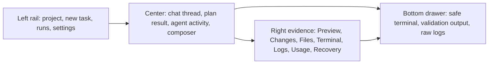
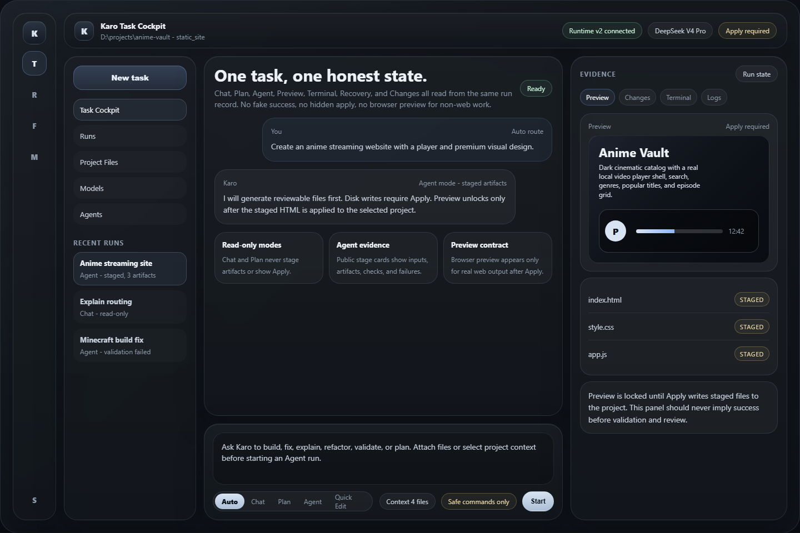
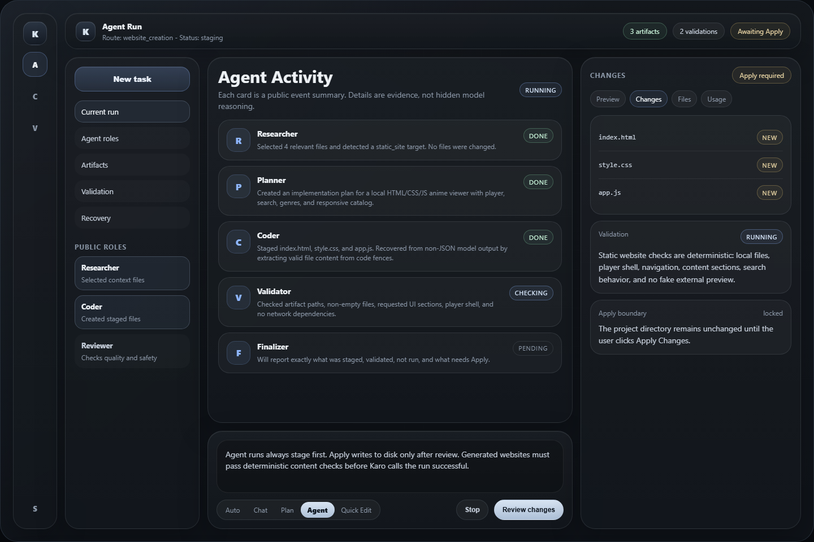
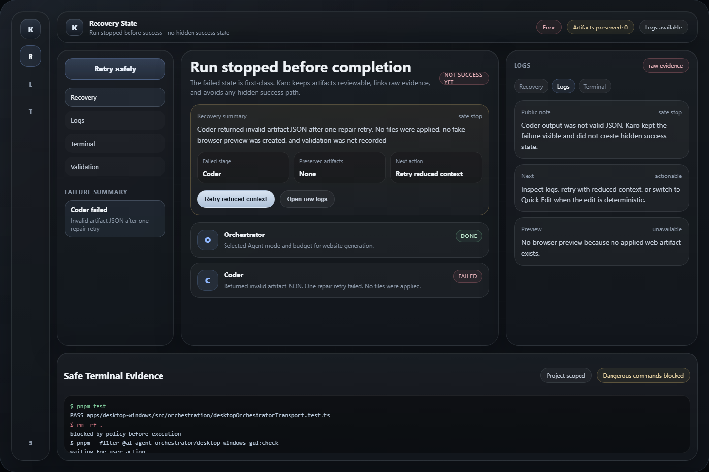
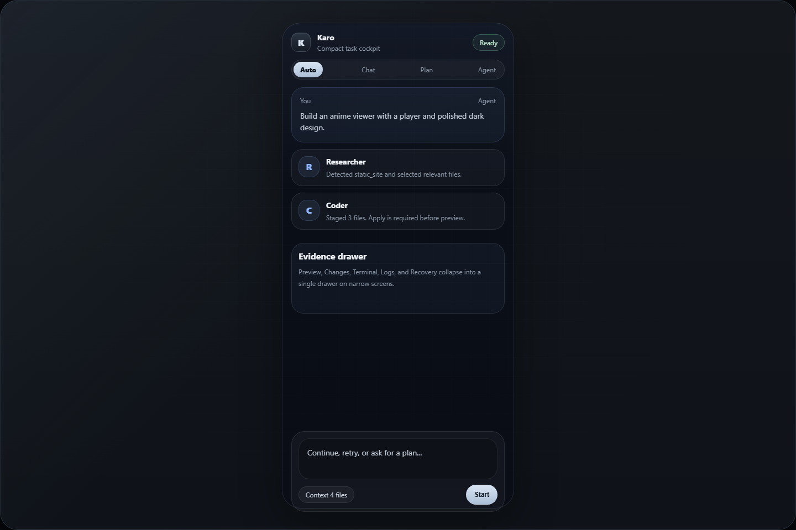

# Karo Native AI IDE v3 UI Direction

This design package defines the target interface for Karo as a local-first AI IDE, not a website-only generator. It is a product/UI contract for the next implementation pass and a visual checkpoint for judging whether the app feels like a premium task cockpit.

## Product Goal

Karo should feel like a focused native IDE where every surface reflects one honest task state:

- Chat and Plan are read-only.
- Agent and Quick Edit create staged artifacts only.
- Apply is explicit and required before disk writes.
- Preview is available only for real preview targets.
- Terminal is a safe project-scoped command runner, not a fake full PTY.
- Recovery states are visible, specific, and never presented as success.

## Target Shape

The main screen is a three-zone cockpit with an optional bottom tool drawer:

## Screen Anatomy

| Zone | Purpose | Must show | Must not show |
| --- | --- | --- | --- |
| Left rail | Navigation and run memory | Current project, new task, recent runs, mode hints | Debug ids as primary content |
| Center thread | The work conversation | User intent, public agent stages, plan/final/recovery cards | Hidden chain-of-thought or provider dumps |
| Composer | Task command surface | Mode selector, selected context, permission/apply contract | Too many advanced controls by default |
| Right evidence | Proof and review | Preview, staged changes, files, logs, usage, recovery | Stale state from another run |
| Bottom drawer | Command evidence | Safe commands, validation output, blocked commands | Fake shell affordances |

## Flow Contract

| Flow | User promise | Primary UI | Evidence panel |
| --- | --- | --- | --- |
| Casual chat | Read-only answer | Compact assistant response | Empty evidence with useful explanation |
| Plan mode | Read-only plan | Plan Result card with phases, risks, tests | No artifacts, no Apply button |
| Quick Edit | Small safe edit | Staged artifact card | Changes with Apply required |
| Agent website generation | Full artifact run | Public Agent Activity cards | Changes, validation, Preview after Apply |
| Software/Minecraft work | Build/test evidence | Stage timeline and final report | Terminal/Logs/Validation, no fake browser preview |
| Failure/recovery | Honest partial state | Recovery card with failed stage and next action | Logs and preserved artifacts |

## Visual Language

Karo should feel like a serious native IDE with a restrained graphite surface system. The target is premium and calm, not "AI neon" and not a colorful marketing dashboard.

Core tokens:

- `ink-0` `#07090d`: app background.
- `ink-1` `#0d1117`: shell background.
- `ink-2` `#121821`: panel base.
- `ink-3` `#171f2b`: raised card.
- `line` `rgba(198, 211, 224, 0.12)`: panel border.
- `text` `#eef2f6`: primary text.
- `muted` `#8c98a8`: supporting text.
- `steel` `#8fb7ff`: selected state and primary action.
- `jade` `#7fc99b`: success/validated.
- `amber` `#d8b66d`: warning/recovery.
- `red` `#d77a86`: failure/destructive.

Type:

- App chrome: 12-13px, medium weight, high letter clarity.
- Thread body: 14-15px, comfortable line height.
- Cards: short titles, clear stage labels, no dense raw JSON.
- Hero/welcome: 28-34px only on true empty states.

Surface rules:

- Panels use matte graphite surfaces, 1px borders, small inner highlights, and restrained shadows.
- Interactive controls have one clear selected state, usually border + subtle fill rather than saturated color.
- Important safety states use content and iconography, not color alone.
- Empty states answer: what this panel shows, why it is empty, what unlocks it.
- Gradients are allowed only as subtle depth, not as decoration. Avoid multi-color glow backgrounds.

## Mockups

The HTML source is `mockup.html`. Generated PNGs are checked in as design references:

- 
- 
- 
- 

## Implementation Notes

Use this as the target for the next code pass:

- Split the current workbench into shell, rail, thread, composer, activity cards, evidence panel, terminal drawer, and recovery modules.
- Replace public `thought` language with `public_note`, `stage_summary`, or `evidence`.
- Bind every card to Runtime v2 state instead of local UI-only flags.
- Use project kind to decide whether Preview, Terminal, or Validation is the main evidence.
- Keep advanced controls available but collapsed unless the user opens them.
- The default right panel should be contextual. Do not show every possible tab when there is no active run.
- Generated website artifacts should use a stronger built-in design prompt with real local player shells, structured sections, and deterministic validation.

## Acceptance Checklist

- Five screenshots show a coherent product: chat, plan, agent activity, preview/apply, terminal/recovery.
- A failed run shows a visible failed stage, preserved artifacts if any, logs, retry actions, and "not success yet" language.
- A non-web project does not show fake browser preview.
- Plan mode has no artifact or Apply affordance.
- Agent mode does not apply files without explicit user action.
- Terminal runs only allowlisted commands and records output as evidence.
- No raw model dumps, hidden reasoning labels, or debug ids are prominent in the main UI.
