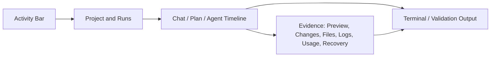
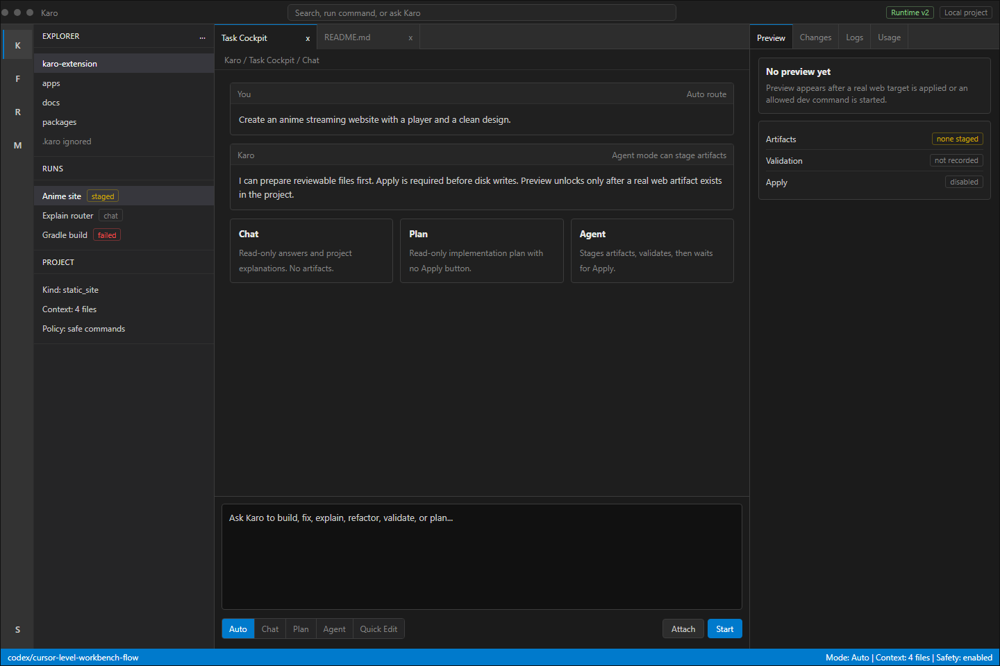
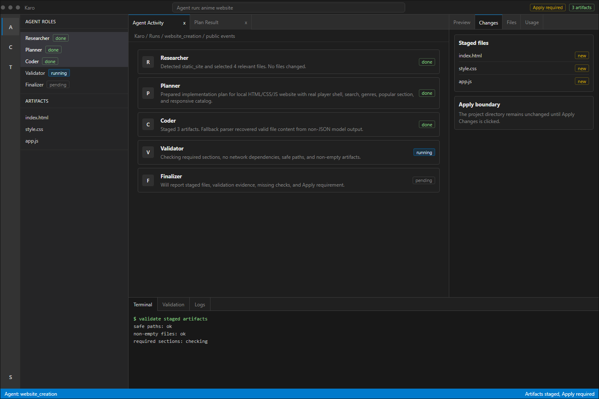
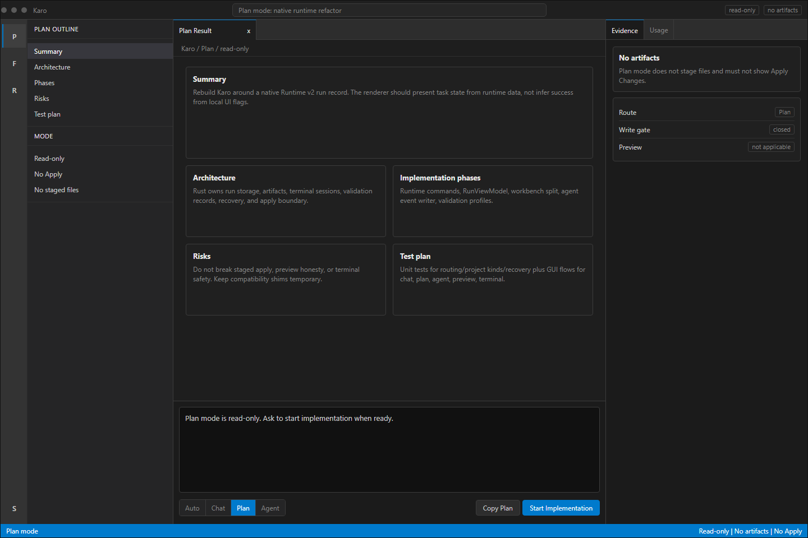
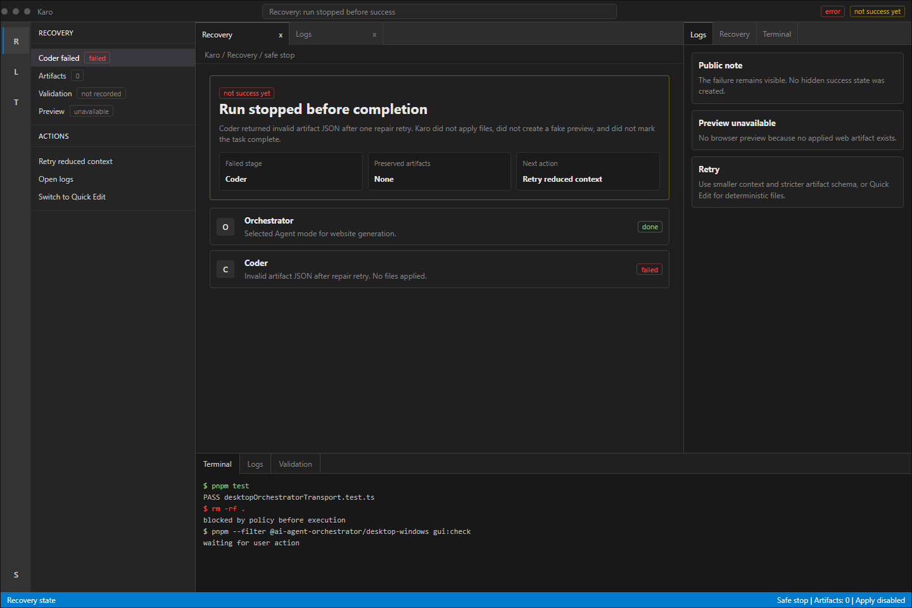
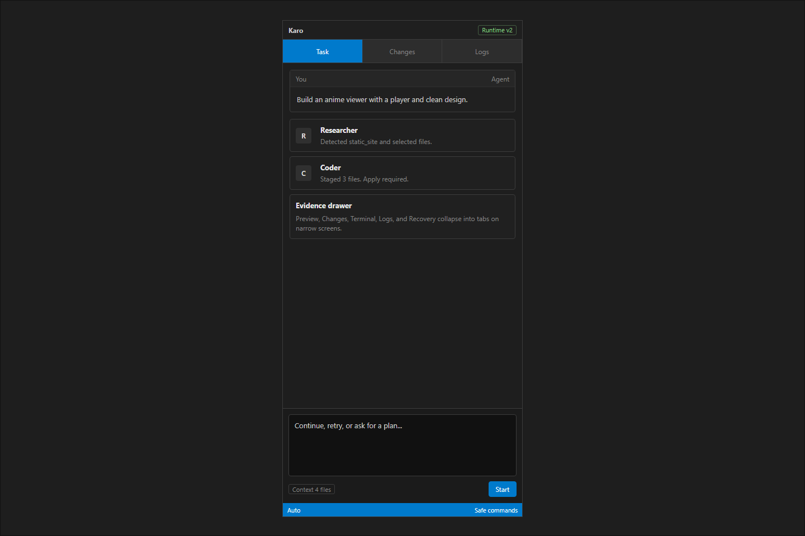

# Karo Native AI IDE v4 Standard UI

Status: superseded by `docs/design/karo-native-ai-ide-v5-cursor-grade`. v4 fixed the palette, but it was still too plain and wireframe-like to be the target product direction.

This is the replacement direction for the previous v3 mockups. The v3 direction was too colorful and too "AI product" in presentation. v4 moves Karo toward a conventional native IDE surface with standard dark theme colors, dense layout, and clear run evidence.

## Direction

Use a standard IDE palette and interaction model:

- No neon, glass, liquid, glow, decorative gradients, or colorful brand treatment.
- Use ordinary dark theme surfaces, similar in restraint to VS Code/Codex-style tools without copying any brand.
- Keep color for selection, links, and statuses only.
- Make the product feel useful before it feels designed.
- Prefer compact panels, tabs, split panes, file lists, command rows, terminal output, and explicit state labels.

## Standard Colors

| Token | Value | Use |
| --- | --- | --- |
| `activity` | `#333333` | far-left icon rail |
| `side` | `#252526` | project/run sidebar |
| `workbench` | `#1e1e1e` | main editor/chat area |
| `panel` | `#181818` | bottom terminal/log panel |
| `tab` | `#2d2d2d` | tab strip and raised rows |
| `border` | `#3c3c3c` | separators |
| `text` | `#cccccc` | primary text |
| `muted` | `#858585` | secondary text |
| `accent` | `#007acc` | selected state and primary action |
| `accent-hover` | `#0e639c` | hover/action |
| `success` | `#89d185` | completed/validated |
| `warning` | `#cca700` | apply/recovery |
| `error` | `#f14c4c` | failed/danger |

## Layout Contract

## Product Rules

- Chat mode is read-only and should look like a normal conversation inside an IDE workbench.
- Plan mode is read-only and should look like a plan document, not an agent run.
- Agent mode shows public stages and staged artifacts. Apply is required.
- Preview appears only when a real web target exists. It is disabled for staged-only files and non-web projects.
- Terminal is a safe command runner. It records evidence and blocks dangerous commands before execution.
- Recovery is a real state with failed stage, preserved artifacts, logs, retry action, and "not success yet" language.

## Mockups

Generated from `mockup.html` with `render-mockups.mjs`.

- 
- 
- 
- 
- 

## Implementation Target

For the real UI, this means:

- Replace decorative color tokens with the standard palette above.
- Reduce border radius to 4-8px for most controls.
- Remove glow/shadow as a primary design language.
- Make right evidence tabs contextual, but style them like standard IDE tabs.
- Make agent cards denser and closer to task rows than marketing cards.
- Put terminal/log evidence in a bottom panel style.
- Keep Karo branding small and utilitarian.

The design should feel closer to a native development environment than a landing page or AI SaaS dashboard.
