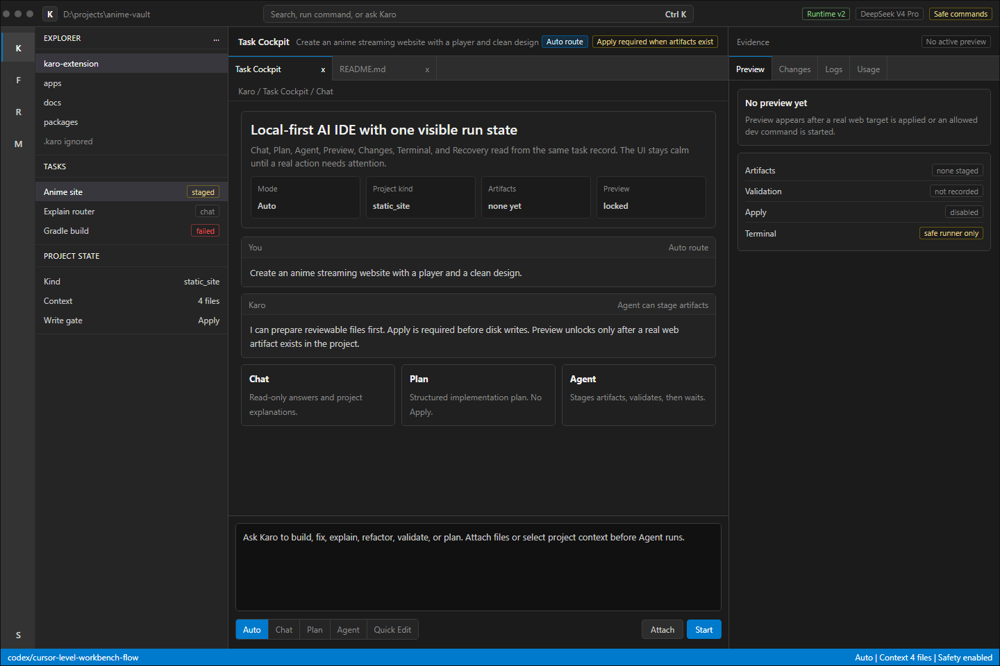
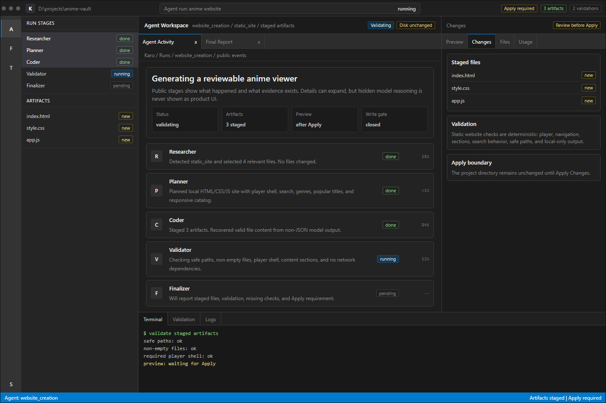
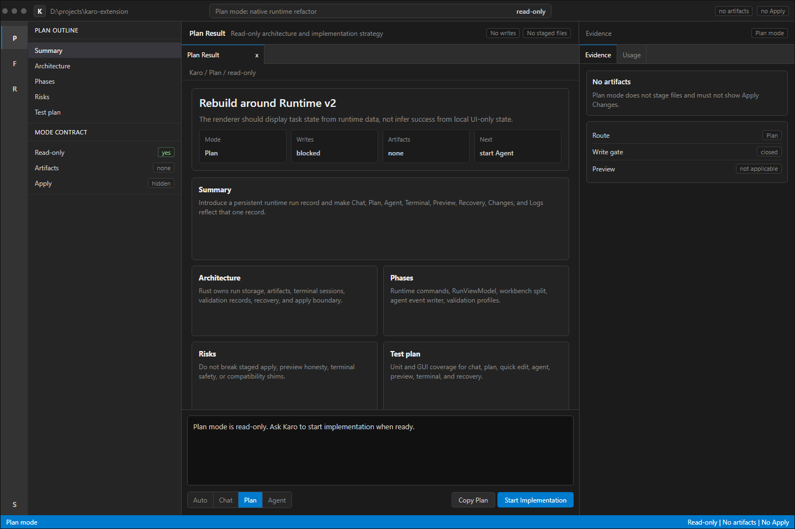
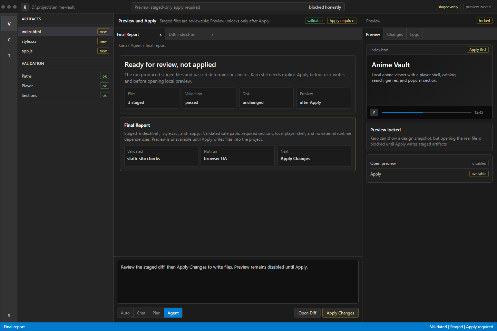
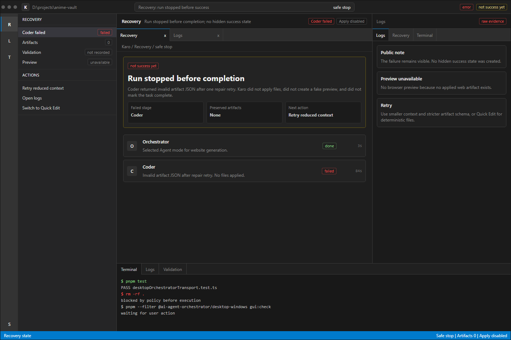
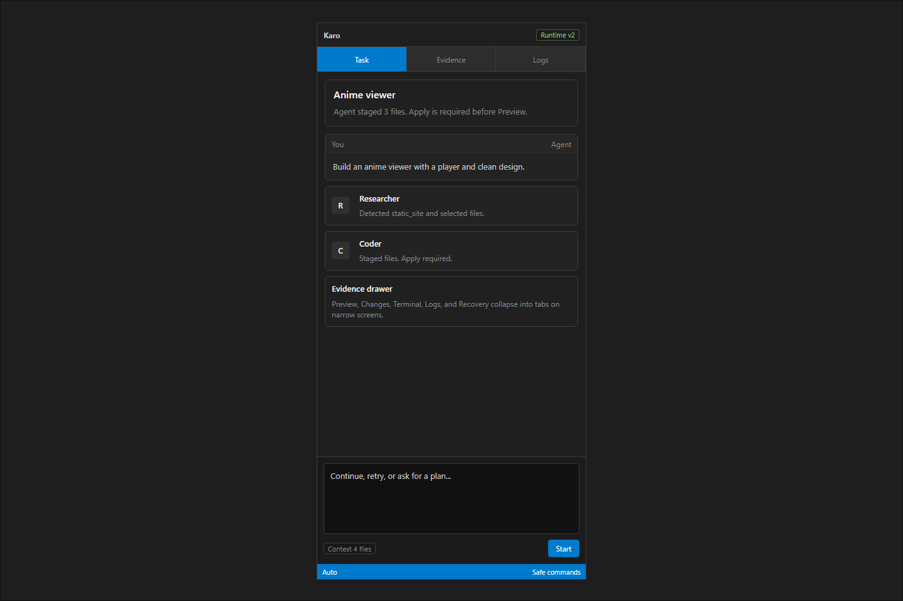

# Karo Native AI IDE v5 Cursor-Grade Standard UI

This direction replaces v4 as the design target. v4 fixed the over-colored AI aesthetic, but it was too plain and too close to a bare VS Code wireframe. v5 keeps standard IDE colors while raising the product quality: better density, stronger task context, clearer agent evidence, and more refined split panes.

The goal is not to copy Cursor branding. The goal is Cursor-grade maturity:

- The active task is always visible.
- Agent progress feels like a real background workspace, not a chat transcript with badges.
- Evidence panels explain why a run is ready, blocked, failed, or waiting for Apply.
- Standard dark theme colors are used consistently.
- UI feels native, compact, and operational.

## Palette

This remains a standard IDE palette:

| Token | Value | Use |
| --- | --- | --- |
| `activity` | `#333333` | icon rail |
| `side` | `#252526` | sidebar |
| `workbench` | `#1e1e1e` | editor/chat surface |
| `panel` | `#181818` | terminal/evidence drawer |
| `raised` | `#232323` | messages/cards |
| `hover` | `#2a2d2e` | selected rows |
| `border` | `#3c3c3c` | separators |
| `text` | `#cccccc` | body text |
| `strong` | `#f0f0f0` | headings |
| `muted` | `#8a8a8a` | secondary text |
| `accent` | `#007acc` | selected state and primary action |
| `success` | `#89d185` | completed |
| `warning` | `#cca700` | apply/recovery |
| `error` | `#f14c4c` | failed |

## What Changed From v4

- Better top command bar and task header.
- Stronger center pane: task summary, run state, activity, and final/report areas are clearly separated.
- Right evidence panel has real decision states, not just generic tabs.
- Agent cards are denser and more precise: role, public summary, evidence, status, duration.
- Preview/Apply flow is explicit without feeling like an error.
- Recovery screen is more readable and more actionable.
- Compact layout uses a drawer model instead of simply shrinking the desktop UI.

## Screens

Generated from `mockup.html` with `render-mockups.mjs`.

- 
- 
- 
- 
- 
- 

## Implementation Target

For real UI work:

- Keep the standard palette, but add polish through spacing, density, and hierarchy rather than color.
- Topbar should expose command/search, active project, model, runtime, and safety in one calm row.
- The center should present the active task as a workspace with thread + public run timeline.
- The right panel should be evidence-first: what exists, what is blocked, what can be applied, what was validated.
- The bottom panel should be terminal/log evidence and should not pretend to be a full PTY.
- The composer should stay compact, with mode selector and one primary action.
- Do not use decorative glow, marketing cards, or colorful AI branding.
