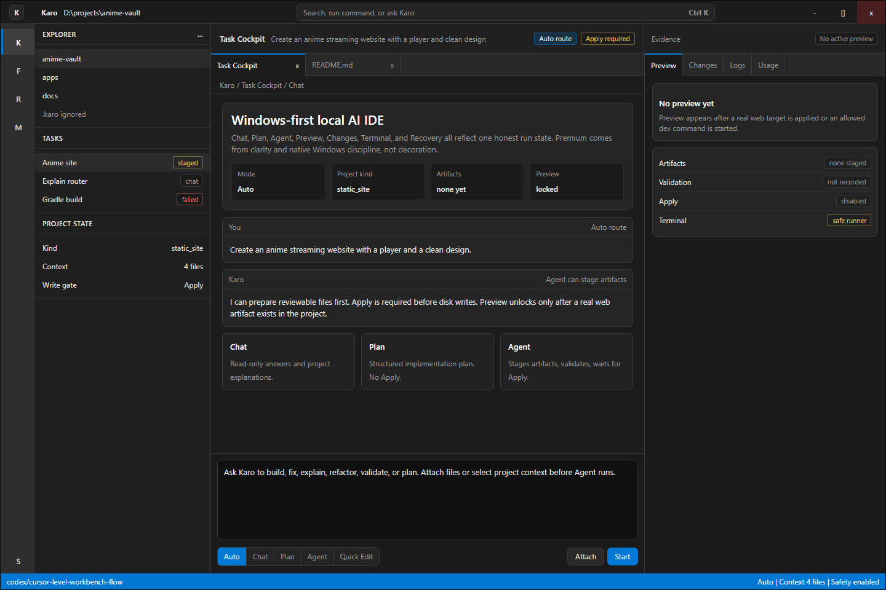
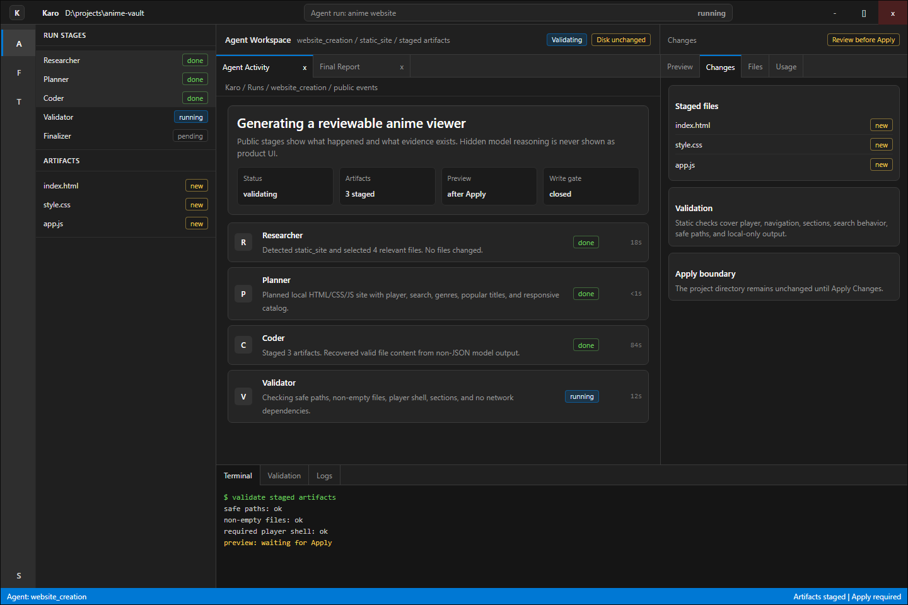
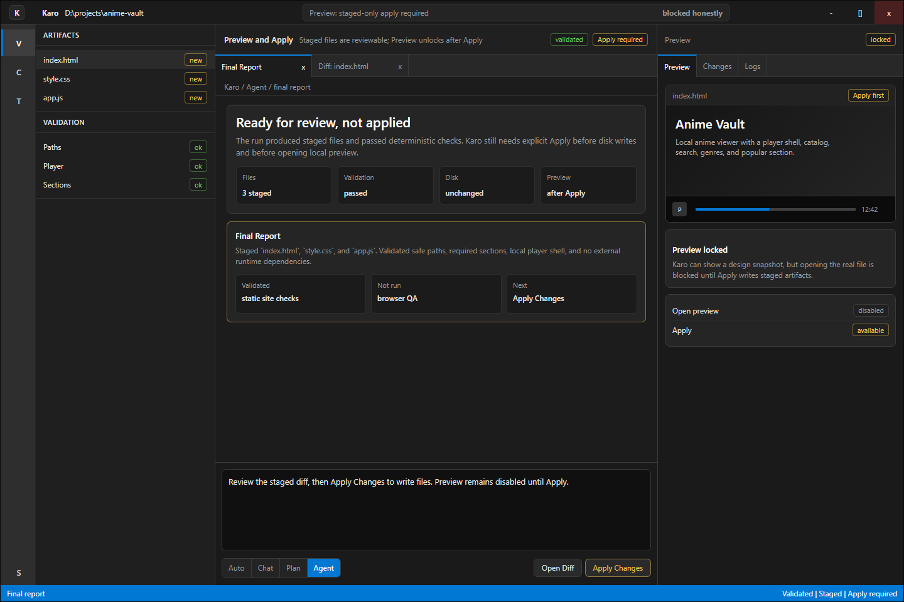
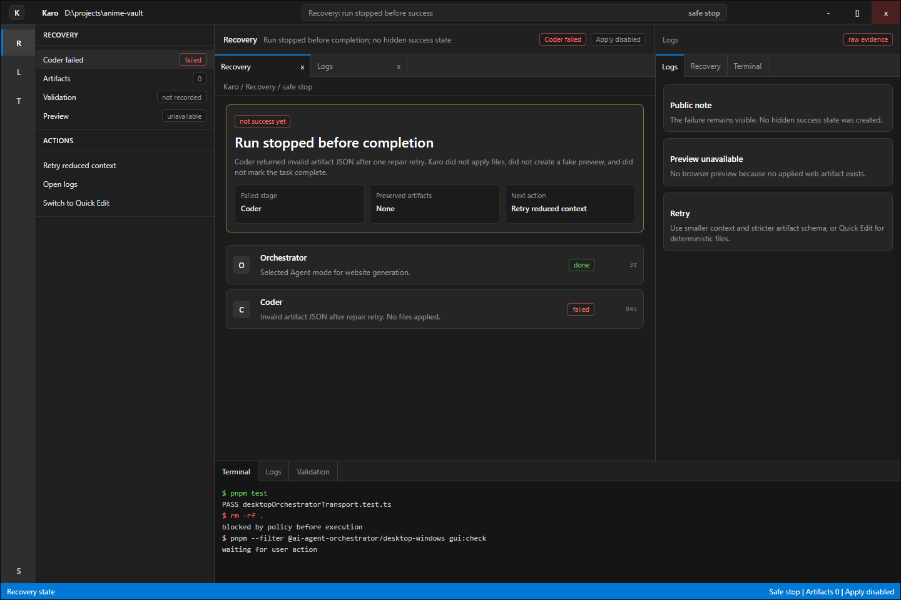
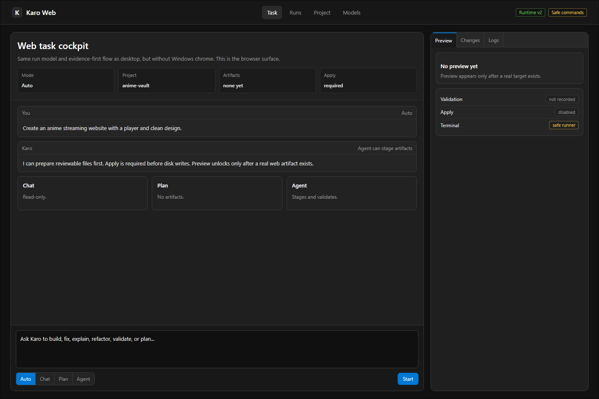
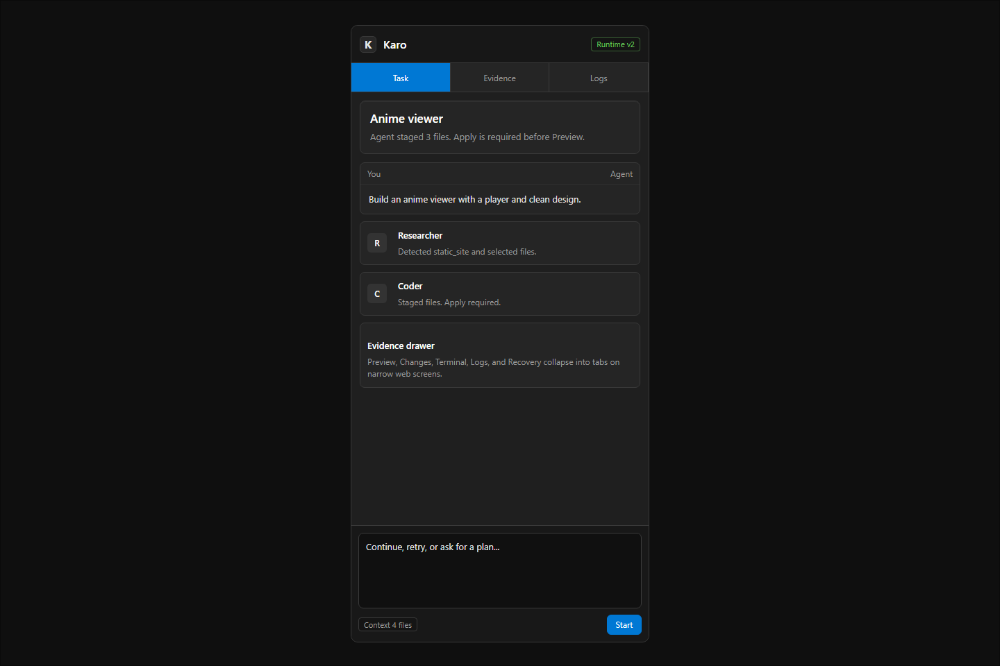

# Karo Native AI IDE v6 Windows + Web Premium

This direction supersedes v5. v5 improved the IDE maturity, but it still used generic desktop chrome and did not target the current product reality clearly enough: Karo is Windows desktop first, with a web surface. v6 is the target direction for both.

## Product Target

Karo should feel like a premium Windows-first AI IDE:

- Windows desktop app, not a macOS-style shell.
- Web app surface for browser use, without desktop window chrome.
- Standard Windows/Fluent dark palette.
- Premium through layout, typography, spacing, and state clarity, not decorative color.
- Strong Agent workspace with visible run state, staged artifacts, validation, recovery, and Apply boundary.

## Visual Rules

- No traffic-light window controls.
- Use Windows caption buttons: minimize, maximize, close.
- Use Segoe UI and Windows-like command bars.
- Use small 4-8px radius controls, not bubbly pills everywhere.
- Use accent blue only for selection and primary actions.
- Use status colors only for semantic states.
- Avoid glass/neon/glow. Subtle shadows and stroke hierarchy are allowed.

## Palette

| Token | Value | Use |
| --- | --- | --- |
| `app` | `#0f0f0f` | outer app background |
| `titlebar` | `#1b1b1b` | Windows titlebar |
| `surface` | `#1f1f1f` | main panes |
| `surface-2` | `#252525` | raised rows/cards |
| `surface-3` | `#2b2b2b` | selected/hover |
| `stroke` | `#3a3a3a` | separators |
| `stroke-soft` | `#2f2f2f` | inner separators |
| `text` | `#e6e6e6` | primary text |
| `muted` | `#9a9a9a` | secondary text |
| `accent` | `#0078d4` | Windows accent / primary |
| `success` | `#6ccb5f` | success |
| `warning` | `#f3c74f` | warning/apply |
| `error` | `#ff6b6b` | failure |

## Screens

Generated from `mockup.html` with `render-mockups.mjs`.

- 
- 
- 
- 
- 
- 

## Implementation Target

For the real app:

- Replace mac/generic mockup assumptions with Windows-native chrome and command layout.
- Keep the Agent Core rules: Chat/Plan read-only, Agent staged artifacts, Apply required, safe terminal only.
- Make top command bar the product anchor: project, command/search, model, runtime, safety.
- Make right panel evidence-first: why Preview/Apply/Validation/Recovery is enabled or blocked.
- Web app should share the same information architecture but without window chrome and with a web navigation shell.
- Do not add login/hosting/cloud/payments.
