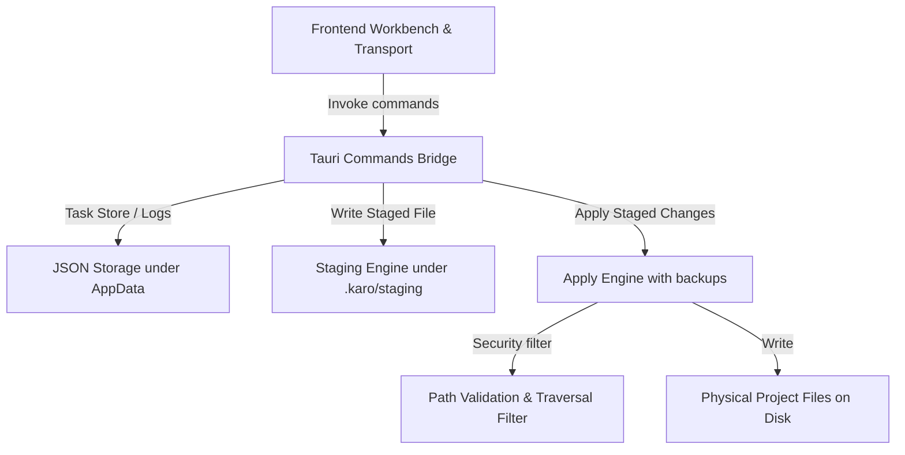

# Implementation Plan — Foundation Rebuild Sprint (Real Disk Apply & Persistent Task Core)

This plan moves Karo from an in-memory frontend simulation to a true desktop AI IDE. It introduces real file staging under `.karo/staging/`, secure file modifications strictly within the project directory, and persistent task run history that survives app restarts.

## User Review Required

> [!IMPORTANT]
> **Key Security Restrictions Added:**
> - Writing outside the active project root is strictly blocked (rejects path traversal attempts `..` and absolute path injection).
> - Sensitive files like `.env`, `.env.local`, and custom secret configs are hard-blocked from being overwritten by default.
> - Destructive operations (like file deletion) are completely disabled or require explicit future configuration (not permitted in this sprint).

> [!NOTE]
> **Lightweight JSON Persistence Storage:**
> To ensure compatibility across different development environments without introducing heavy compilation requirements on Windows (e.g. `rusqlite` needing C compilers/build tools), we implement a reliable JSON-based storage layer under the user's Tauri `app_data_dir`. The architecture is designed with clean interfaces so it can be swapped to SQLite or SQLCipher in the future without changing frontend contracts.

---

## Proposed Changes

We will restructure the Tauri Rust backend to be modular and secure, register new commands, update TypeScript bindings, and wire the frontend interaction.

---

### Rust Core Architecture (`apps/desktop-windows/src-tauri/src/`)

#### [NEW] [errors.rs](file:///D:/проекты/karo-exstention/apps/desktop-windows/src-tauri/src/errors.rs)
Defines unified `ShellError` codes mapped to frontend requirements:
- `NotImplemented`
- `InvalidPath`
- `OutsideWorkspace`
- `PermissionDenied`
- `ApplyConflict`
- `IoError`
- `StorageError`
- `ProbeFailed`

#### [NEW] [paths.rs](file:///D:/проекты/karo-exstention/apps/desktop-windows/src-tauri/src/paths.rs)
Normalizes paths and provides safety checks:
- Rejects paths containing path traversal `..`.
- Guarantees that target paths reside within the workspace/project root.
- Rejects sensitive file accesses (e.g. `.env`, `.env.*`, `karo.key`).

#### [NEW] [storage.rs](file:///D:/проекты/karo-exstention/apps/desktop-windows/src-tauri/src/storage.rs)
Manages the application storage:
- Stores non-secret settings and task runs in the Tauri App Data directory as JSON database files (`settings.json` and `tasks.json`).
- Auto-initializes on startup.
- Supports encrypted blobs in memory (or using basic encryption with a fallback key, with a clear TODO warning) so they aren't kept plaintext.

#### [NEW] [tasks.rs](file:///D:/проекты/karo-exstention/apps/desktop-windows/src-tauri/src/tasks.rs)
Defines Rust representations for the task run history data types:
- `TaskRun`, `AgentRun`, `Artifact`, `FileChange`, `ApplyResult`, `TaskStatus`.

#### [NEW] [staging.rs](file:///D:/проекты/karo-exstention/apps/desktop-windows/src-tauri/src/staging.rs)
Manages the `.karo/staging/task_<id>` sandbox:
- Saves generated file changes to isolation directory first.
- Provides lists of staged files and their sizes/versions.

#### [NEW] [apply.rs](file:///D:/проекты/karo-exstention/apps/desktop-windows/src-tauri/src/apply.rs)
Runs the writing engine:
- Reads staged files and writes them to their physical location inside the project root.
- Creates backup files (`.bak` or copy in storage) before overwriting an existing file, permitting rollback.
- Assembles and returns the comprehensive `ApplyResult` mapping.

#### [NEW] [security.rs](file:///D:/проекты/karo-exstention/apps/desktop-windows/src-tauri/src/security.rs)
Implements active policy checks for operations:
- Hard-blocks shell command executions without consent.
- Enforces strict write policies.

#### [NEW] [commands.rs](file:///D:/проекты/karo-exstention/apps/desktop-windows/src-tauri/src/commands.rs)
Declares all external Tauri command endpoints:
- `shell_validate_folder_path`
- `shell_read_project_summary`
- `shell_read_file`
- `shell_write_staged_file`
- `shell_get_staged_changes`
- `shell_apply_staged_changes`
- `shell_create_task_run`, `shell_update_task_run`, `shell_get_task_run`, `shell_list_task_runs`, `shell_add_agent_run`, `shell_add_artifact`
- settings: `shell_read_local_setting`, `shell_write_local_setting`, `shell_delete_local_setting`, `shell_encrypt_local_secret`, `shell_decrypt_local_secret`.

#### [MODIFY] [lib.rs](file:///D:/проекты/karo-exstention/apps/desktop-windows/src-tauri/src/lib.rs)
Imports the modules, defines the AppState structural cache (containing the Storage and Staging structures), maps the Tauri plugins and sets up setup/run lifecycle hooks.

---

### Frontend Core Integration (`apps/desktop-windows/src/`)

#### [MODIFY] [types.ts](file:///D:/проекты/karo-exstention/apps/desktop-windows/src/shell/types.ts)
Adds typing definitions for the new Tauri IPC commands:
- Filesystem staging & apply methods.
- Task persistent history methods.

#### [MODIFY] [nativeBindings.ts](file:///D:/проекты/karo-exstention/apps/desktop-windows/src/shell/nativeBindings.ts)
Bridges TypeScript to the newly declared Tauri commands.

#### [MODIFY] [desktopOrchestratorTransport.ts](file:///D:/проекты/karo-exstention/apps/desktop-windows/src/orchestration/desktopOrchestratorTransport.ts)
Integrates backend persistence & staging:
- When a task runs and Coder/Fixer produces artifacts, calls `shell_write_staged_file` to write them in the real staging sandbox.
- When creating or modifying task states, invokes `shell_create_task_run` and `shell_update_task_run` to store task runs persistently.
- Exposes `applyStagedChanges(taskId)` to invoke the real apply operation on the Rust backend.
- Hydrates existing tasks from `shell_list_task_runs` during bootstrap.

#### [MODIFY] [workbench.ts](file:///D:/проекты/karo-exstention/apps/desktop-windows/src/ui/workbench.ts)
Updates the UI workbench:
- Renders an interactive "Apply Changes" button in the **Changes** pane when changes are available.
- Renders the outcome of the Apply Changes operation (showing modified files, backups made, and physical disk paths).
- Hydrates the sidebar and center runs history dynamically.
