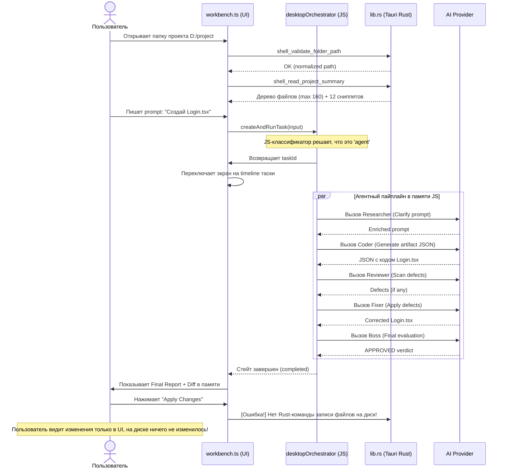
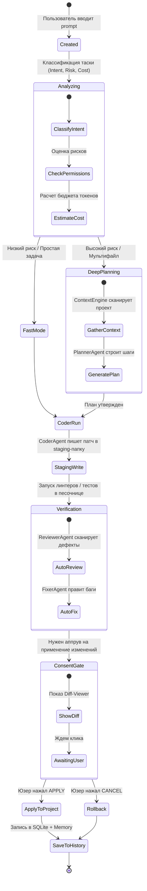

# 🧐 Технический и продуктовый аудит AI-платформы Karo

> **Статус документа:** Финальный отчет-аудит (Read-Only Анализ)  
> **Автор:** Antigravity (Product Architect, Lead Software Engineer & AI System Designer)

 Karo задумывался как мощный **Visual Assembly Line** AI-агентный оркестратор и специализированная AI IDE. Главная фантазия продукта: *«Karo превращает дешёвые/обычные AI-модели в управляемую команду агентов, которая может работать над кодовыми проектами лучше, дешевле и безопаснее, чем обычный чат»*.

Однако реальное исследование кодовой базы показывает глубокую пропасть между концептом и текущей технической реализацией. Ниже представлен честный, бескомпромиссный и глубокий технический аудит Karo.

---

## 1. Что этот проект представляет из себя сейчас

Текущая кодовая база Karo — это **монорепозиторий на pnpm**, состоящий из:
*   `apps/desktop-windows` — Tauri-десктоп приложение (наш основной фокус).
*   `apps/backend` — Node.js бэкенд (отдельный сервис).
*   `apps/web` — веб-версия приложения (в зачаточном состоянии).
*   `packages/` — общие библиотеки (shared-core, shared-ui, client-sdk, validation, agent-contracts).

### Горькая правда о реализации:
1. **Десктопное приложение — это иллюзия интеграции.** Tauri Rust-бэк (`apps/desktop-windows/src-tauri/src/lib.rs`) почти полностью заглушен! Команды сохранения настроек, работы с шифрованием секретов (DPAPI/keyring), логирования, экспорта файлов и выполнения тестов возвращают `ShellError::NotImplemented`.
2. **Вся «агентность» крутится в браузере (рендерере).** Поскольку Tauri Rust-бэк ничего не умеет делать, разработчики перенесли всю оркестрацию в JS-код рендерера (`desktopOrchestratorTransport.ts`). Оркестратор работает **полностью в оперативной памяти** WebView2. При перезапуске приложения все задачи и логи стираются.
3. **Фейковый стейджинг и редактирование файлов.** В приложении **нет реальной записи изменений на диск**. Поскольку Tauri-команды записи отсутствуют, агенты пишут «артефакты» в память. Попытка применить патч к реальным файлам проекта физически невозможна на стороне Rust.
4. **Контекст проекта — «замочная скважина».** Код рендерера считывает дерево проекта через `shell_read_project_summary`. Однако лимиты жестко ограничены: максимум 160 путей файлов и сниппеты содержимого **только для 12 предопределенных файлов** (таких как `package.json`, `vite.config.ts`, `workbench.ts`). Никакого умного поиска, векторного индекса или полного считывания кода проекта нет. Модель работает вслепую.
5. **Агенты — это плоские шаблоны промптов.** Агенты (`Researcher`, `Coder`, `Reviewer`, `Fixer`, `Boss`) не являются автономными процессами. Это просто цепочка последовательных вызовов LLM по API с жестко зашитыми системными промптами.
6. **Роутер на регулярных выражениях.** Классификация намерений пользователя (`classifyPromptIntent`) написана на примитивных регулярках в JS (ищет ключевые слова "создай", "исправь", "найди"). Никакой интеллектуальной оценки сложности, рисков или стоимости токенов нет.

---

## 2. Во что проект пытается превратиться

Проект пытается двигаться в сторону **AI IDE / Agent Orchestrator** (подобно Cursor, но с упором на мультиагентное планирование для усиления слабых моделей вроде Gemini 3.5 Flash).

| Желаемое направление (Концепт) | Текущее состояние (Реальность) | Соответствие |
|---|---|---|
| **Desktop AI IDE** | Браузерное SPA, запущенное внутри Tauri-окна с заглушенным Rust-бэкендом. | ❌ Нет (Эмуляция) |
| **Agent Orchestrator** | Линейная цепочка вызовов LLM в памяти рендерера, без параллелизма и долгосрочной памяти. | ⚠️ Частично (Жесткий пайплайн) |
| **Diff-first Workflow** | Диффы генерируются в памяти рендерера, но их нельзя надежно применить на диск. | ❌ Нет |
| **Project Memory & Context** | Отсутствует. Память проекта не сохраняется, контекст обрезан до 12 файлов. | ❌ Нет |
| **Permission & Consent Gate** | Есть UI-заглушка для аппрува тест-команд, но реального контроля безопасности на уровне ОС нет. | ❌ Нет |

Текущая реализация **не совпадает** с направлением полноценного продукта. Это хрупкий прототип (MVP), написанный с архитектурными компромиссами, которые блокируют развитие.

---

## 3. Текущая карта архитектуры

Архитектура Karo сейчас крайне грязная, с размытыми границами ответственности и дублированием. Бэкенд (`apps/backend`) полностью оторван от десктопного приложения.

```mermaid
graph TD
    subgraph Frontend (Tauri WebView2)
        UI[workbench.ts: 135KB Monolith] -->|Calls| DOT[desktopOrchestratorTransport.ts: 104KB]
        DOT -->|Decrypted Keys| MCM[modelClient.ts]
        MCM -->|HTTPS requests proxy| RustBridge[Tauri IPC Bridge]
    end

    subgraph Rust Core (Tauri Shell)
        RustBridge -->|Invoke Commands| TauriRust[lib.rs: NotImplemented stubs]
        TauriRust -->|shell_provider_probe| Probe[reqwest Outbound HTTP]
        TauriRust -->|shell_read_project_summary| FS[std::fs scan limit 160 files]
    end

    subgraph Unused Backend (NodeJS)
        BE_Orch[runTaskPipeline.ts]
        BE_Agents[boss.ts, coder.ts...]
    end
    
    style TauriRust fill:#f9f,stroke:#333,stroke-width:2px
    style BE_Orch fill:#ccc,stroke:#333,stroke-dasharray: 5 5
```

### Детальный разбор компонентов:

#### Frontend:
*   `apps/desktop-windows/src/ui/workbench.ts` (135 KB):
    *   *Ответственность:* Рендеринг всего UI (сайдбар, чат, таймлайн агентов, настройки, дерево файлов, diff viewer, панель логов) с использованием ванильного JS/TS (`document.createElement`).
    *   *Проблемы:* Огромный спагетти-файл. Нарушен принцип Single Responsibility. UI-код смешан с логикой стейт-менеджмента, парсинга веб-страниц, обработки тасок и логирования. Изменение любой кнопки грозит поломкой всего интерфейса.
*   `apps/desktop-windows/src/orchestration/desktopOrchestratorTransport.ts` (104 KB):
    *   *Ответственность:* Реализация логики тасок, стейт-машины и оркестрации агентов на стороне фронтенда.
    *   *Проблемы:* Дублирует логику бэкенда (`apps/backend/src/orchestrator/runTaskPipeline.ts`). Содержит захардкоженные системные промпты агентов. Вся история и артефакты живут только в оперативной памяти.

#### Backend/Core (Неиспользуемый):
*   `apps/backend/src/orchestrator/runTaskPipeline.ts`:
    *   *Ответственность:* Серверный пайплайн оркестратора. Реализован намного качественнее, чем десктопный транспорт, имеет интеграцию со стейджингом на диске.
    *   *Проблемы:* **Мертвый код** для десктопного приложения. Десктопная версия Tauri никак с ним не взаимодействует.

#### AI/Agent Layer:
*   `apps/desktop-windows/src/orchestration/modelClient.ts`:
    *   *Ответственность:* Вызов OpenAI-совместимых моделей через Tauri-прокси `shell_provider_probe` (для обхода CORS/CSP).
    *   *Проблемы:* Поддерживает только OpenAI-совместимые эндпоинты. Поддержка Anthropic и других провайдеров отсутствует (заглушена с ошибкой `wrong_api_shape`).

#### Storage:
*   `apps/desktop-windows/src/storage/localKvStore.ts`:
    *   *Ответственность:* Локальное хранилище настроек (в памяти или JSON-файл).
    *   *Проблемы:* Небезопасно. Секреты шифруются во фронтенде через WebCrypto и сохраняются в JSON/LocalStorage, так как Rust-команды шифрования DPAPI возвращают `NotImplemented`.

---

## 4. Главный user flow сейчас



### Оценка текущего Flow:
*   **Это полезно?** Абсолютно нет. Разработчик не может использовать инструмент, который не сохраняет результаты работы на физический диск.
*   **Это ощущается как IDE?** Нет. Нет редактора кода, нет возможности открыть и редактировать произвольный файл, дерево проекта ограничено 160 элементами.
*   **Где всё ощущается фейковым?** Агентный таймлайн красивый, анимации крутятся, но отсутствие связи с файловой системой делает все приложение "игрушкой в песочнице".

---

## 5. Самые большие продуктовые проблемы

### 1. Отсутствие реального сохранения изменений (Apply to Disk)
*   *В чем суть:* Агенты генерируют код, но записать его в файлы на диске невозможно.
*   *Почему мешает:* Делает приложение на 100% бесполезным.
*   *Severity:* **CRITICAL**
*   *Рекомендация:* Срочно реализовать Tauri/Rust команды записи файлов и интеграции со staging-директорией.

### 2. Слепнущий контекст проекта (Context Blindness)
*   *В чем суть:* Контекст ограничен 12 захардкоженными файлами. Если задача требует изменения файла, не входящего в этот список, Coder его не увидит.
*   *Почему мешает:* Ограничивает работу простейшими "hello world" примерами. Агент не видит структуры проекта.
*   *Severity:* **CRITICAL**
*   *Рекомендация:* Спроектировать реальный `ContextEngine`, сканирующий релевантные файлы по запросу, а не по жесткому списку.

### 3. Фейковая безопасность и отсутствие реальных Permissions
*   *В чем суть:* Вся безопасность "согласия" (Consent Gate) реализована на уровне UI-модалок в JS. Rust-часть не проверяет безопасность запускаемых команд. Секреты (API-ключи) не защищены системным хранилищем.
*   *Почему мешает:* Огромный риск безопасности при работе с реальными shell-командами. Ключи API могут быть легко украдены из LocalStorage.
*   *Severity:* **HIGH**
*   *Рекомендация:* Переписать хранилище ключей на Rust с использованием `keyring` (DPAPI/Keychain).

### 4. Отсутствие Task Persistence (Потеря данных при перезапуске)
*   *В чем суть:* Все запущенные задачи, трассировка агентов и отчеты живут в оперативной памяти JS. Обновление страницы или перезапуск приложения стирает всё.
*   *Почему мешает:* Невозможно посмотреть историю работы, проанализировать прошлые ошибки агентов или продолжить прерванную задачу.
*   *Severity:* **HIGH**
*   *Рекомендация:* Внедрить SQLite на стороне Rust для хранения истории тасок и артефактов.

---

## 6. Самые большие технические проблемы

### 1. Монолитный спагетти-UI (`workbench.ts`)
*   *Почему это плохо:* Файл на 135КБ, управляющий DOM напрямую через императивный JS. Любое усложнение логики приводит к экспоненциальному росту багов. Отсутствует компонентный подход.
*   *Как исправить:* Разделить UI на независимые веб-компоненты или переписать интерфейс на легкий UI-фреймворк (например, SolidJS или React), но с сохранением премиального дизайна.

### 2. Дублирование и изоляция Core-логики оркестратора
*   *Почему это плохо:* Логика оркестрации продублирована в `apps/backend/src/orchestrator` (серверный TS) и `apps/desktop-windows/src/orchestration` (клиентский TS). При этом Tauri-версия использует урезанную, полностью in-memory версию, игнорируя наработки бэкенда.
*   *Как исправить:* Перенести ядро оркестратора в общий пакет (`packages/shared-core`) или сделать Rust-бэкенд Tauri полноценным оркестратором, вызывающим агентов.

### 3. Отсутствие обработки ошибок провайдеров (Model Fallbacks)
*   *Почему это плохо:* Если у Fireworks или OpenAI падает API или исчерпан лимит, пайплайн агентов ломается без возможности переключения на резервную модель (например, локальную или более дешевую).
*   *Как исправить:* Реализовать `FallbackManager` на уровне `modelClient.ts`.

---

## 7. Аудит AI/agent системы

Давайте ответим на вопросы честно:

| Вопрос | Ответ | Пояснение |
|---|---|---|
| **Агенты реально запускаются отдельно?** | ❌ Нет | Это просто последовательные вызовы LLM-функций в едином JS-потоке. |
| **Есть настоящий orchestrator?** | ❌ Нет | Текущий JS-транспорт — это жестко закодированный цикл, а не гибкий оркестратор. |
| **Есть model router?** | ❌ Нет | Маршрутизации моделей нет, используется одна выбранная пользователем модель для всех шагов. |
| **Есть task/risk classification?** | ❌ Нет | Есть примитивный регулярный разбор prompt на клиенте. |
| **Есть context selection?** | ❌ Нет | Выбираются жестко 12 файлов. |
| **Есть memory?** | ❌ Нет | Проектная память полностью отсутствует. |
| **Есть reviewer loop?** | ⚠️ Частично | Есть цикл Coder->Reviewer->Fixer в памяти рендерера, ограниченный 5 итерациями. |
| **Есть diff-based editing?** | ❌ Нет | Агенты генерируют полные файлы, диффы строятся на клиенте только для визуализации. |
| **Есть permission system?** | ❌ Нет | Полностью отсутствует на уровне ядра Rust. |
| **Достаточно ли надежна система для реальных проектов?** | ❌ **Нет** | В текущем состоянии Karo не способен работать над реальными проектами. |

### Как должна выглядеть настоящая версия:
Настоящий AI-оркестратор должен работать на уровне **Rust Core**. Rust должен управлять процессами, сканировать файлы через высокопроизводительный движок (типа ripgrep), вести базу данных SQLite, шифровать ключи через OS-keyring и вызывать агентов как изолированные асинхронные задачи. 

---

## 8. Аудит системы режимов

В текущем коде выбор режима (`ComposerMode`: `auto`, `chat`, `assist`, `agent`) влияет только на то, какая ветка логики сработает в `classifyTaskIntent`. 

### Что эти режимы делают сейчас:
*   `chat` — обычный одиночный запрос к модели.
*   `assist` — одиночный запрос с подмешиванием краткого контекста (анализ проекта).
*   `agent` — запуск полного in-memory пайплайна агентов (Researcher -> Coder -> ...).
*   `auto` — пытается автоматически выбрать один из трех режимов выше на основе регулярных выражений в промпте.

Это исключительно UI-лейблы. Они не меняют контекстный бюджет, не меняют тип модели (дешёвая/дорогая), не влияют на безопасность и лимиты стоимости.

### Как должно быть (Идеальное поведение):

```markdown
┌────────────────────────────────────────────────────────────────────────┐
│                              AUTO MODE                                 │
│      (Анализирует сложность задачи, риски и контекст через LLM)         │
└───────────────────────────────────┬────────────────────────────────────┘
                                    │
         ┌──────────────────────────┼──────────────────────────┐
         ▼                          ▼                          ▼
   [ FAST MODE ]             [ SMART MODE ]              [ DEEP MODE ]
  • Простые правки          • Задачи на 2-3 файла       • Архитектурные таски
  • 1 дешёвая модель        • Planner + Coder           • Мультиагентный цикл
  • Без планирования        • Локальный Reviewer        • Тяжёлый Review + Tests
  • Стоимость: $0.001       • Стоимость: $0.01          • Стоимость: $0.10+
```

---

## 9. UI/UX аудит

### Сильные стороны:
*   Красивая Cursor-style структура (сайдбар слева, чат в центре, вкладки результатов справа).
*   Премиальная темная тема, приятные micro-animations таймлайна агентов.
*   Удобная идея разделения экранов: чат не засоряется кодом, код всегда справа во вкладках Preview/Changes/Diff.

### Критические проблемы:
1. **Отсутствие Editor.** Нет встроенного редактора кода. Вкладка "Files" просто показывает дерево, но вы не можете открыть файл и отредактировать его руками.
2. **Слепая консоль логов.** Панель "Logs" показывает логи работы агента, но пользователь не видит реального вывода терминала (stdout/stderr запускаемых команд).
3. **Невидимость токенов и стоимости.** Пользователь не контролирует расходы. Пайплайн может совершить 15 вызовов дорогой модели и потратить $2 за одну таску, но в UI нет ни счетчика токенов, ни цены.
4. **Сложность навигации по артефактам.** Если Coder сгенерировал 5 файлов, переключение между ними в Diff-viewer неудобное.

---

## 10. Что нужно удалить или игнорировать

Текущий проект перегружен фейковыми абстракциями и недостроенными слоями.

| Компонент / Файл | Рекомендация | Причина |
|---|---|---|
| `apps/desktop-windows/src/orchestration/desktopOrchestratorTransport.ts` | **Rewrite / Move to Core** | Нельзя держать логику оркестрации во фронтенде. Ее нужно вынести в Rust-бэк или общий core-пакет. |
| `apps/desktop-windows/src/ui/workbench.ts` | **Rewrite (Componentize)** | Монолит 135КБ на чистом JS нежизнеспособен. Требуется рефакторинг на компоненты. |
| Tauri Rust KV заглушки в `lib.rs` | **Rewrite (Implement)** | Заглушки `NotImplemented` для настроек и шифрования должны быть заменены реальным кодом Rust. |
| `apps/backend` (весь проект) | **Ignore / Archive** | Сейчас это мертвый груз. Его логику нужно использовать как референс, но сам серверный процесс десктопу не нужен. |
| `apps/web` | **Ignore** | Преждевременная фича. Сначала нужно заставить работать десктоп. |

---

## 11. Что стоит сохранить

Кодовая база содержит отличные наработки, которые глупо выбрасывать:
1. **Дизайн-систему CSS (`main.css`)** — стили, переменные, анимации, скругления, glassmorphism-эффекты выполнены потрясающе. Это нужно сохранить на 100%.
2. **Логику стейт-машины бэкенда (`apps/backend/src/orchestrator/stateMachine.ts`)** — очень чистая реализация стейтов на TS.
3. **Алгоритмы валидации путей и проксирования запросов в `lib.rs`** — функции `shell_provider_probe` и `shell_read_project_summary` написаны на Rust грамотно и работают отлично.
4. **Интеграционные тесты** — тесты бэкенда написаны очень подробно с использованием Vitest. Их нужно сохранить для верификации будущих рефакторингов.

---

## 12. Рефакторить или переписывать?

> 💡 **Рекомендация: Глубокий рефакторинг ядра (Partial Rewrite Core + Reuse UI Styling & Setup).**

Полностью переписывать проект с нуля — дорогая ошибка, так как мы потеряем отличную визуальную верстку, настроенный Tauri-монорепозиторий и отлаженные конфигурации сборки. 

### Стратегия спасения Karo:
1. **UI:** Сохранить HTML/CSS структуру, но разбить монолит `workbench.ts` на изолированные модули/компоненты.
2. **Core:** Выкинуть in-memory эмуляцию оркестратора из рендерера (`desktopOrchestratorTransport.ts`). Вместо этого переписать Tauri Rust-бэк (`lib.rs`), чтобы он реализовывал реальный `Orchestrator` и общался с файловой системой.
3. **Storage:** Заменить заглушки Rust реальной SQLite базой данных и шифрованием `keyring`.

---

## 13. Идеальная архитектура продукта

Для превращения Karo в лидирующий инструмент спроектирована следующая чистая трехслойная архитектура:

```
┌────────────────────────────────────────────────────────────────────────┐
│                        RENDERER UI (SolidJS / TS)                      │
│  • IDE Shell  • Editor Tabs  • Task Console  • Diff  • Agent Timeline  │
└───────────────────────────────────┬────────────────────────────────────┘
                                    │ Tauri IPC (Commands / Events)
┌───────────────────────────────────▼────────────────────────────────────┐
│                           TAURI RUST CORE                              │
│                                                                        │
│   ┌─────────────────────┐ ┌────────────────────┐ ┌─────────────────┐   │
│   │  AgentOrchestrator  │ │   ContextEngine    │ │  ModelRouter    │   │
│   └──────────┬──────────┘ └─────────┬──────────┘ └────────┬────────┘   │
│              │                      │                     │            │
│   ┌──────────▼──────────┐ ┌─────────▼──────────┐ ┌────────▼────────┐   │
│   │   StagingManager    │ │   SecurityGate     │ │   KeyringStore  │   │
│   └─────────────────────┘ └────────────────────┘ └─────────────────┘   │
└───────────────────────────────────┬────────────────────────────────────┘
                                    │
┌───────────────────────────────────▼────────────────────────────────────┐
│                            LOCAL SYSTEM / OS                           │
│  • SQLite DB  • File System  • DPAPI / Keychain  • OS Process (Shell)  │
└────────────────────────────────────────────────────────────────────────┘
```

---

## 14. Правильный task execution lifecycle

Ниже представлен надежный и безопасный жизненный цикл выполнения задачи в Karo:



---

## 15. Правильная логика Auto Mode

Реальный `Auto Mode` должен быть интеллектуальным диспетчером, а не набором регулярных выражений.

### 1. Правила эскалации (Когда включается Deep Mode):
*   **Мультифайловые изменения:** Если задача затрагивает больше одного файла (например, "добавь кнопку и стилизуй ее в css-файле").
*   **Архитектурные изменения:** Изменения конфигурационных файлов (`package.json`, `tsconfig.json`, `vite.config.ts`).
*   **Безопасность/БД:** Изменение схем баз данных, файлов `.env`, логики авторизации.
*   **Низкая уверенность (Confidence):** Если классификатор оценивает уверенность модели ниже 85%.
*   **Повторная попытка:** Если предыдущий простой запуск завершился ошибкой компиляции или тестов.

### 2. Правила согласия (Consent Gate):
Система **обязана** требовать явного одобрения пользователя на следующие действия:
*   Удаление любых файлов в проекте.
*   Изменение файлов, содержащих секреты (`.env`, `config.private.json`).
*   Установка новых npm-пакетов или изменение `package.json`.
*   Запуск любых shell-команд в терминале (билды, тесты).

---

## 16. Правильный дизайн Агентов (Agent Design)

Каждый агент должен запускаться как изолированная атомарная задача (Job) со строгим контрактом на входе и выходе. Агенты не должны быть абстрактными "персонажами" — это функциональные блоки пайплайна.

### Модель данных Agent Run (SQLite):
```sql
CREATE TABLE agent_runs (
    id TEXT PRIMARY KEY,
    task_id TEXT NOT NULL,
    agent_role TEXT NOT NULL, -- planner, coder, reviewer, tester, researcher
    model_id TEXT NOT NULL,
    input_context TEXT NOT NULL, -- JSON входных данных
    output_response TEXT NOT NULL, -- JSON ответа
    token_usage_input INTEGER,
    token_usage_output INTEGER,
    cost REAL,
    status TEXT NOT NULL, -- running, completed, failed
    started_at TEXT NOT NULL,
    finished_at TEXT
);
```

---

## 17. Дизайн Context Engine

`ContextEngine` должен собирать контекст динамически по принципу "пирамиды релевантности", укладываясь в лимиты контекстного окна модели.

```
                  ┌──────────────────────────┐
                  │   User Prompt & Custom   │
                  │   Selected Files (100%)  │
                  └────────────┬─────────────┘
                               │
               ┌───────────────▼───────────────┐
               │    Active File & Imports      │
               │    (AST-анализ связей) (80%)  │
               └───────────────┬───────────────┘
                               │
               ┌───────────────▼───────────────┐
               │    SQLite Project Memory      │
               │    (Архитектура, Стек) (50%)  │
               └───────────────┬───────────────┘
                               │
               ┌───────────────▼───────────────┐
               │  Search Hits / ripgrep scan   │
               │  (Поиск по ключевым словам)   │
               └───────────────────────────────┘
```

---

## 18. Дизайн Memory System

Память проекта должна храниться локально в файле `.karo/memory.json` (или SQLite) в корне открытого проекта и быть доступной для редактирования пользователем через интерфейс.

### Разделы памяти:
1.  **Project Stack:** Технологии, версии, фреймворки (автоопределение при сканировании).
2.  **Architecture Decisions:** Архитектурные паттерны (например, "используем FSD", "пишем только функциональные компоненты").
3.  **Coding Style:** Правила форматирования (табы/пробелы, кавычки).
4.  **Do Not Touch:** Список файлов или папок, которые агентам строго запрещено модифицировать.
5.  **Fix History:** Лог прошлых ошибок и успешных исправлений (модель учится на своих ошибках при повторном запуске).

---

## 19. Безопасность и разрешения (Permission and Safety Design)

### Категории разрешений (Permissions):
*   `ReadFiles` — чтение файлов проекта (по умолчанию разрешено).
*   `WriteFiles` — создание и перезапись файлов.
*   `DeleteFiles` — удаление файлов.
*   `ExecuteCommands` — запуск shell/терминальных команд.
*   `NetworkAccess` — доступ к сети (веб-поиск, подгрузка док).
*   `ManageSecrets` — чтение/запись ключей API.

### Политики (Policies):
1.  **Always Allow (Небезопасно):** Автоматическое применение без вопросов.
2.  **Ask Every Time (Рекомендуется для записи/выполнения):** Модалка согласия.
3.  **Ask Once per Session:** Спросить один раз, затем помнить до закрытия приложения.
4.  **Never Allow:** Полный блок (например, запрет на удаление файлов).

---

## 20. Продуктовый Roadmap

```
   MVP 0: "Честное ядро"         MVP 1: "Реальный Staging"       MVP 2: "Умный контекст"
   • Замена заглушек Rust        • Реальное сохранение файлов    • ContextEngine с AST
   • База SQLite для тасок       • Терминал и логи (Rust-based)  • SQLite Project Memory
   • Шифрование keyring          • Diff-Viewer с диска           • Настоящий Auto Mode
        │                             │                               │
   ─────┼─────────────────────────────┼───────────────────────────────┼─────────────► Time
        │                             │                               │
   MVP 3: "Команда агентов"      MVP 4: "Полноценная IDE"        MVP 5: "Релиз"
   • Раздельные Agent Runs       • Встроенный редактор кода      • Контроль бюджетов
   • Planner & Tester            • Полноценный File Explorer     • Маркетплейс плагинов
```

---

## 21. Immediate Next Actions (Первоочередные шаги)

### 🚀 Приоритет 1: Оживление Tauri-бэкенда (Rust)
*   **Действие:** Заменить заглушки `NotImplemented` в `lib.rs` реальной имплементацией.
*   **Зачем:** Без реальной работы с файловой системой и безопасного сохранения секретов проект остается фейком.
*   **Что затронет:** `apps/desktop-windows/src-tauri/src/lib.rs`.
*   **Результат:** Рабочие команды шифрования, записи файлов в стейджинг и сохранения настроек.

### 📦 Приоритет 2: База данных SQLite для истории тасок
*   **Действие:** Настроить SQLite базу данных на стороне Rust для сохранения стейтов тасок и логов.
*   **Зачем:** Устранить проблему потери данных при перезапуске/обновлении интерфейса.
*   **Что затронет:** `lib.rs`, создание таблиц при запуске Tauri.
*   **Результат:** Надежная история запусков, доступная после перезапуска.

### 🛠️ Приоритет 3: Рефакторинг UI-монолита `workbench.ts`
*   **Действие:** Начать распиливать файл `workbench.ts` на логические модули (сайдбар, чат, настройки, diff-viewer).
*   **Зачем:** Снизить сложность кодовой базы фронтенда, сделать код поддерживаемым.
*   **Что затронет:** `apps/desktop-windows/src/ui/workbench.ts`.
*   **Результат:** Чистый UI-слой, готовый к интеграции с реальными Rust-командами.

---

## 22. Final Verdict (Итоговый вердикт)

**Что это за проект сейчас?**  
Сейчас Karo — это очень красивый, визуально проработанный, но абсолютно нефункциональный десктопный макет. Это "симулятор AI IDE в песочнице браузера", который не имеет реального доступа к файловой системе для записи результатов и не умеет сохранять свое состояние.

**Почему он ощущается плохо?**  
Пользователь чувствует фальшь. Красивые анимации агентов крутятся, но код проекта на диске не меняется, настройки сбрасываются при перезапуске, а контекст модели настолько мал, что она совершает глупые ошибки из-за слепоты.

**Можно ли его спасти?**  
**Да, определенно.** В проекте проделана колоссальная визуальная работа, стили и дизайн-система выглядят премиально и современно. Логика стейт-машины на бэкенде написана грамотно. 

Чтобы проект стал по-настоящему ценным, должна заработать одна минимальная вещь: **реальный сквозной пайплайн записи изменений на диск через изолированный стейджинг с одобрением пользователя.** Агент должен мочь прочитать любой файл проекта, сгенерировать патч, а Tauri Rust-ядро должно записать его на диск после клика по кнопке "Apply".

**Самая опасная ошибка, которую нельзя допустить дальше:**  
Попытка продолжать наращивать UI-фичи (добавлять новые вкладки, настраивать новых агентов) на текущем "гнилом" фундаменте in-memory эмуляции. Сначала нужно починить ядро Rust и работу с диском/БД, и только потом развивать продукт дальше.
